# NWS Klausurrelevante Themen

- [NWS Klausurrelevante Themen](#nws-klausurrelevante-themen)
- [Grundlagen II](#grundlagen-ii)
	- [Bedrohungslage](#bedrohungslage)
		- [Killchain/Attack Life Cycle](#killchainattack-life-cycle)
	- [Stand der Technik](#stand-der-technik)
	- [IT-Sicherheit](#it-sicherheit)
		- [Basis Sicherheitscheck](#basis-sicherheitscheck)
	- [Schutzziele](#schutzziele)
	- [Sicherheitsmechanismen](#sicherheitsmechanismen)
	- [Sicherheitsmaßnahmen](#sicherheitsmaßnahmen)
		- [Organisatorische Maßnahmen:](#organisatorische-maßnahmen)
		- [Technische Maßnahmen:](#technische-maßnahmen)
	- [Authentisierung](#authentisierung)
- [Grundlagen Netzwerke](#grundlagen-netzwerke)
	- [ISO/OSI](#isoosi)
	- [TCP/IP](#tcpip)
- [Data Link Layer](#data-link-layer)
	- [VPN](#vpn)
		- [Layer 1](#layer-1)
		- [Layer 2](#layer-2)
		- [Layer >=3](#layer-3)
	- [Port Security 802.1x](#port-security-8021x)
- [DHCP](#dhcp)
	- [Nutzen/Verwendung:](#nutzenverwendung)
	- [Architektur](#architektur)
	- [Angriffe](#angriffe)
- [Domain Name System DNS](#domain-name-system-dns)
	- [Delegation und Zonen](#delegation-und-zonen)
	- [Software](#software)
	- [Auflösung von Domain-Namen](#auflösung-von-domain-namen)
	- [RFCs](#rfcs)
	- [Takeaway](#takeaway)
	- [Design](#design)
- [DNSSEC](#dnssec)
	- [Herausvorderungen](#herausvorderungen)
	- [Lösungen](#lösungen)
- [LDAP Leightweight Directory Access Protocol](#ldap-leightweight-directory-access-protocol)
	- [Vor/Nachteile](#vornachteile)
	- [Verzeichnis](#verzeichnis)
- [Basisdienste - AD](#basisdienste---ad)
	- [Aufbau](#aufbau)
	- [Domäne](#domäne)
	- [Orga. Einheit OU](#orga-einheit-ou)
	- [Objekte](#objekte)
	- [Sicherheit](#sicherheit)
- [RADIUS](#radius)
	- [Anwendungsmöglichkeiten](#anwendungsmöglichkeiten)
	- [Grundlegende Funktion](#grundlegende-funktion)
	- [Sicherheit](#sicherheit-1)
- [PKI/SSL, Verschlüsselung](#pkissl-verschlüsselung)
	- [Symmetrische Verschlüsselung](#symmetrische-verschlüsselung)
	- [Asymmetrische Verschlüsselung](#asymmetrische-verschlüsselung)
	- [PFS Perfect Forward Secrecy](#pfs-perfect-forward-secrecy)
	- [PKI](#pki)
		- [Klasse 1](#klasse-1)
		- [Klasse 2](#klasse-2)
		- [Klasse 3](#klasse-3)
		- [X.509 PKIX Cert](#x509-pkix-cert)
		- [Revocation](#revocation)
		- [SSL/TLS](#ssltls)
	- [Takeaway](#takeaway-1)
- [Firewalls I](#firewalls-i)
	- [Paketfilter Technologie](#paketfilter-technologie)
	- [FTP](#ftp)
	- [Bastion Host](#bastion-host)
	- [Dual Homed Host](#dual-homed-host)
		- [Vorteile](#vorteile)
		- [FW Systeme heute](#fw-systeme-heute)
	- [Sicherheit](#sicherheit-2)
- [Firewalls II](#firewalls-ii)
	- [Stateful Packetfilter](#stateful-packetfilter)
	- [ALG Application Level Gateway](#alg-application-level-gateway)
	- [Hybrid FW](#hybrid-fw)
- [Proxy Server](#proxy-server)
	- [Implementierung](#implementierung)
- [VPNs Virtuelle Private Netze](#vpns-virtuelle-private-netze)
	- [OpenVPN](#openvpn)
- [E-Mail Sicherheit](#e-mail-sicherheit)
- [E-Mail Sicherheit II](#e-mail-sicherheit-ii)
	- [# ENDE KLAUSUR-RELEVANZ](#-ende-klausur-relevanz)
- [Advanced Security Technologies](#advanced-security-technologies)
	- [Vuln Management](#vuln-management)

# Grundlagen II
## Bedrohungslage
### Killchain/Attack Life Cycle


Steps											Examples
- initial Recon						
- initial Compromise			
- establish Foothold			Maleware Downlaod e.g. CnC
- Escalate Privileges			Installation on fileless maleware e.g. Mimikatz
_Loop start_
- internal Recon					Network mapping, host/service enum, user hunting
- Move Laterally					file and objects move over Windows SMB protocols
- Maintain Presence				persistence mechanisms e.g. VBR modification
_Loop end_ 
- complete Mission				Unusual file transfer activity from ADMIN

## Stand der Technik

|Stand der Technik  | | |
|----------|:-------------:|------:|
| hoch <---- |  Innovationsgrad | -----> niedrig |
| Stand Wissenschaft/Forschung |    Stand Technik   |  Allgemeine Regeln der Technik |
| niedrig <----	 | Bewährung Praxis |   -----> hoch |
																					
						
																		


<details>
<summary>Grobes Fazit:</summary>
 
-> Stand der Technik ist auf Mitte zwischen Wissenschaft und allgemein Anerkannter Technik.
- Wissenschaft hat hohen Innovationsgrad aber niedrige Bewährung in der Praxis
- Allgemein anerkannte Regeln der Technik bewährt sich stark in der Praxis, Innovationsgrad ist allerdings eher gering
</details>

## IT-Sicherheit
### Basis Sicherheitscheck   
Nutzen:
- soll schnellen Überblick über vorhandenes Sicherheitsniveau bieten
- gibt Auskunft über fehldende Maßnahmen (soll/ist-Abgleich)
- Grundschutzmaßnahmen werden abgebildet 
- Niveau genügt nur bei niedrigem bis mittlerem Schutzbedarf (schätzung BSI ~80% der IT-Systeme)  
**Ablauf:**
- Interviews helfen den Status quo eines Informationsverbungs zu bestimmen
	- Sicherheitsmaßnahmen der IT-Grundschutz-Kataloge als Richtlinie 
- Ergebnis ist Katalog
	- jede relevante Maßnahme hat Umsetzungsstatus: entbehrlich/ja/teilweise/nein 

## Schutzziele
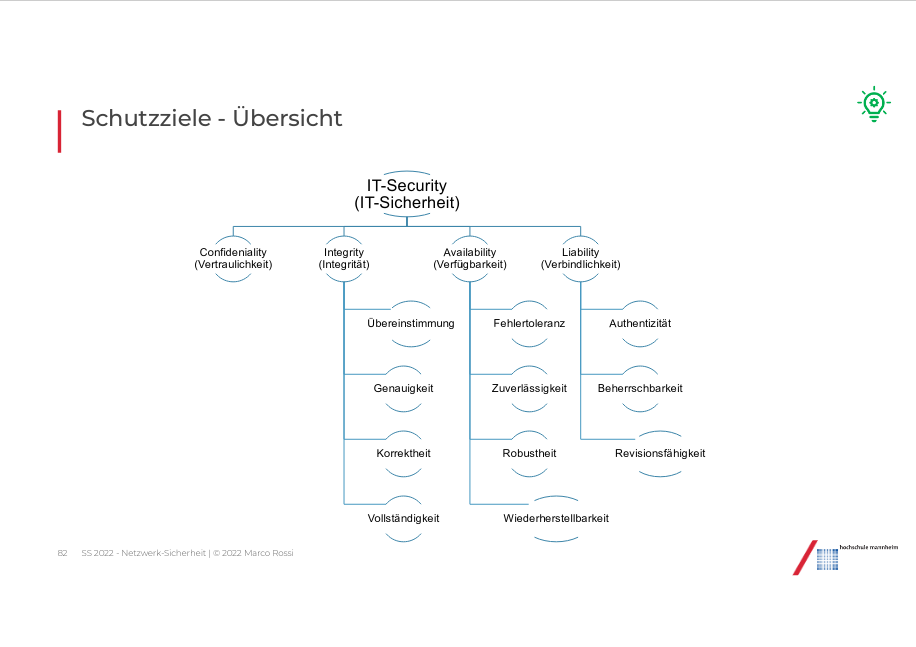

Definieren Anforderungen:  
**CIA**   
- Confidentiality			Vertraulichkeit
- Integrity						Unversehrtheit
- Availability				Verfügbarkeit

**ANL**  
- Authenticity				Authentizität
- Non-repudiation			Verbindlichkeit
- Legitimate use			Nutzungsbeschränkung

## Sicherheitsmechanismen
Definieren Umsetzung zur Erfüllung von Schuztzielen:
- **Authentication** - Authentisierung
_Identität von Akteuren wird sichergestellt_

- **Access protection** - Zugriffsschutz
_Zugriffsversuche auf Ressourcen werden überwacht_

- **Encryption** - Verschlüsselung
_Daten werden unlerserlich gemacht_

- **Auditing** - Protokollierung			
_sicherheitsrelevante Vorgänge im System werden persistiert_

- **Intrusion detection** - Einbruchsdentdeckung
_überwachung von Versuchen, Sicherheitsmaßnahmen zu umgehen_

- **Informationflow control** - Informationsflusskontrolle
_überwachung des Informationsfluss von Instanzen_

- **Interference control** - Interferenzkontrolle
_Schutz gegen Ableiten von nicht berechtigten Informationen aus Daten_


<details>
<summary>Extra:</summary>
 
- **Security reqirements** - Sicherheitsanforderungen
	- Auftraggeber/Entwickler legt fest, welche Schutzziele erreichbar sein sollen
	- Präzisionsgrad variiert. Hohe Anforderungen verwenden formale Sicherheitsmodelle
- **Secuirty policy** - Sicherheitsrichtlinien
	- Sicherheits-Leitlinie -> Sicherheitsstrategie -> Umsetzungsvorgaben
	- betreiber des Systems legen fest, welche Schutzziele erreicht werden sollen
</details>

## Sicherheitsmaßnahmen


|Kategorisierung	   |Gegenstück: Killchain Abschnitt    |
|---|---|
|**Prevention (P)**   | Initial recon - Foothold  |
|**Detection (D)**   | Loop   |
|**Response (R)**  | Complete Mission  |
				


### Organisatorische Maßnahmen:
- P Schulung
- D Auswertung von Log-Files
- R Security Incident Response Prozess

### Technische Maßnahmen:
- P Firewalls
- D Intrusion Detection Systeme
- R Automatisierte Rekonfiguration und technische Maßnahmen

## Authentisierung
Es wird Unterschieden zwischen
- Auth des Datensprungs
- Benutzer Auth
- Peer Entity Auth
	- Einseitung (e.g. Client prüft Server aber nicht umgekehrt)
	- Zwei- oder Mehrseitig

Grundsätzliche Möglichkeiten
- **Wissen** - Something you know (pin/passwd)
- **Besitz** - Something you have (private key, smartcard)
- **Persönliche Eigenschaft** - Something you are (iris-scan, fingerprint)
- **kombinationen aus 1-3**				
- **Delegation** - Someone who knows you (PGP)

# Grundlagen Netzwerke
## ISO/OSI


Aufbau:
|Schicht	   |Richtung   |
|---|---|
|Application   | Versenden   |
|Presentation  |  ↓ |
|Session       |   |
|Transport     |   |
|Network       |   |
|Data Link     |  ↑ |
|Physical      |  Empfangen |


<details>
<summary>Beispiel:</summary>
 
- Absender schriebt E-Mail
- Dieses große Datenpaket wird in Transportschicht in kleine Pakete zerlegt
- Netzwerkschickt erweitert Datenpakete, um Informationen wie zu verwendendes Protokoll 
- Data Link und Physical Layer geben Informationen zur Übertragung an (e.g. Übertragungswege -> Routing)
- Pakete werden abgeschickt
- Entsprechend der enthaltenen Informationen wieder zusammengesetzt
</details>

**Transitsystem**
Datentransport über Netzgrenzen. Öffnet Pakete nur bis Netzwerk Layer, verpackt diese wieder und leitet an Empfänger weiter.

**Historie**
- entwickelte Protokolle zielen auf verlustfreie Übertragung ab
- Damals war Sicherheit der Daten nicht im Fokus
- Wenn man keine zusätzlichen Programme nutzt werden Daten, auch Heute noch, im Klartext übertragen und können von Dritten mitgelesen und verändert werden

- entwickelte Protokolle, vorallem TCP/IP sind heute auf nahezu allen Netzwerken implementiert
- sie sind auf verlustfreie Übertragung ausgelegt (nicht für Datensicherheit)
- Vorallem Unternehmen benötigen daher einen Schutzwall zwischen Unternehmensnetzwerk und Internet
- Ist in erster Linie die Firewall

## TCP/IP

<details>
<summary>Aufbau</summary>
```
Schicht									Protokoll
Anwendung/Application					Telnet, FTP, HTTP, SMTP (E-Mail) ...	
Transport/Transport						TCP, UDP	
Vermittlung/Network						IP + ICMP + IGMP
Verbindung/Host-to-Netzwork				LAN (z.B. Ethernet, Token Ring, ...)
```
</details>

**Data Link Layer**
- Beispiel 00:10:B2:4A:E7
- Jede Netzwerkschnittstelle hat eindeutige Nummer (MAC Media Access Control)
- Die Pakete sind zusätzlich mit Prüfsumme versehen (FCS Frame Check Sequence)
- Kaputte Pakete werden nicht repariert sondern ignoriert


<details>
<summary>Paketaufbau</summary>
 
```
|--- 60 - 1514 Bytes ---|
| Header | Payload		| FCS |
	|
	V
Header:
| Empfänger | Absender | Typ |
```
</details>
[ethernet Numbers iana.org](http://www.iana.org/assignments/ethernet-numbers)

**TCP/IP Encapsulation**
Mit jeden Layer kommen spezifische Informationen zu dem Paket dazu
<details>
<summary>Paket(informations)erweiterung</summary>

```
Application 
| Data | 									<- HTTP, SMTP, ...

Transport
| Data | Header | 							<- UDP, TCP

Inernet
| 		Data	| Header | 					<- IP, ICMP, DHCP, ARP

Link
| 			Data		 | Header |			<- Ethernet, DSL, WiFi, PPP 
```
</details>

**IP Adressen**
- setzt sich aus 4 Zahlenblöcken (durch Punkt getrennt) zusammen
- Jeder Zahlenblock ist 8 Bit groß -> enthält Wert zwischen 0 - 255


Bereiche/Klassen:  
|name	|		erste addr	|	letzte addr	|	Menge|
|---|---|---|---|
|Klasse A |	10.0.0.0 |	 10.255.255.255 |	256x256x256|
|Klasse B |	10.10.0.0 |	 10.10.255.255		|	256x256|
|Klasse C |	10.10.10.0	|10.10.10.255 	|	256|

Wo werden Hex- statt Dezimalzahlen verwendet: IPv6


**TCP Verbindungsaufbau**
3-Way-Hanshake
|Alice	|			|		|	Bob|
|---|---|---|---|
|SYN-Sent |	SYN -> |	  |	 	|
| |	 |	 <- SYN, ACK		|	SYN-RECEIVED|
|ESTABL. |	ACK ->	| 	|	ESTABLISHED|
| |		| ACK, Daten ->	|	|
| |		| <- ACK|	|


[Folien FTP verlinkung](ftp://ftp.isi.edu/in-notes/rfc793.txt)

# Data Link Layer
## VPN
Grundidee:
- Nachbildung logischer Netzstruktur (LAN) in beliebigen Topolo-/Technologien e.g. internet
- Soll bezüglich Vertraulichkeit und Datenintegrität mit pysischen LANs vergleichbar sein
- Virtulalisierung auf jeder Schicht des OSI-Modells möglich

### Layer 1
- VPWS	Virtual Private Wire Service
	- Provider bietet Punkt zu Punkt Verbindung
- VPLS	Virtual Private Line Service (in Layer 2 gleiche Abkürzung)
	- Provider bietet Punkt zu Multipunkt Verbindung
- OPN		Optical Private Link oder Optical Private Network
	- Provider betreibt Glasfaserinfrastruktur
	- Kunde erhält eine Wellenlänge (Farbe) in Infrastruktur
	- Kunde kann diese nutzen wie einen dedizierten Schicht 1 Link
	- Über dieselben Glasfasern werden auch andere Kunden bedient (andere Farbe)

### Layer 2
Umsetzungen
- *VLAN*	Virtual LAN
	- Mehere LAN Broadcast Domains über den selben physischen Link
	- Standard VLAN Tagging
- *VPLS*	Virtual Private LAN Services (in Layer 1 gleiche Abkürzung)
	- Verbindet physisch getrennte (V)LANs miteinander
- Point-to-Point Verbindungen
- Layer2 Tunneling
- ...

Aufgaben

- Fehlerfreie Übertragung von Frames
	- Aufteilung von Bitströmen in Frames
	- Fehlerkorrektur über Prüfsummen (e.g. CRC Cyclic Redundancy Check)
- Flusskontrolle
- Medienzugriffsverfahren für gemeinsam genutztes Übergangsmedium
	- CSMA/CD bei Ethernet
	- CSMA/CA bei WLAN


*VLAN*
- LAN Infrastruktur über mehrere Switches (Gebäude) hinweg
- Logisch vershciedene LANs auf einer Netzkomponente
- Wunsch nach Verkehrs-Trennung
- Heute Standard in Unternehmens- und Hochschulnetzen
	- in Switchen im Consumerberich oft nicht unterstütz

### Layer >=3
- IPSec
- SSL/TLS
- OpenVPN
- WireGuard

## Port Security 802.1x
Standard zur Authentifizierung in Rechnernetzen
- Stellt Methode zur **Authentifizierung** und **Autorisierung** bereit
- Authentifizierung eines Teilnehmers durch den Authenticator erfolgt:
	- Am Netzwerkzugang einem physischen Port im LAN
	- einem logischen Port 
	- oder einem WLAN
- ...durch Authenticator (RADIUS-Server) der Teilnehmer (Supplicant) Auth-Informationen prüft und Zugriff gewährt oder verbietet
	- Zugriff kann Dienste wie LAN,VLAN oder WLAN enthalten
- Durch Auth-Server kann auch lokal unbekannten Teilnehmern der Netzzugang ermöglicht werden
	- e.g. viele Hochschulen über eduroam an andere Hochschulen WLAN nutzen

# DHCP
Ist in OSI auf Layer 5 (Application)

## Nutzen/Verwendung:
- ermöglicht automatische Netzwerkkonfiguration eines Clients durch Server
- Zuordnung IP-Addr erfolgt über MAC-Adresse Netzwerkkarte
	- mobile Clients haben idR. 2: LAN und WLAN
- Zuordnung kann dynamisch aus Pool/Netz oder statisch erfolgen
	- _dyn_ keine Verwaltung, Server vergibt IP-Addr an Client
	- _statisch_ aufwändige Verwaltung:
		- klassisch mit Excel-Listen
		- oder spezielles Werkzeug IPAM IP-Address Management 
- Optionale Konfiguration (neben IP-Addr und Netzwerkmaske)
	- Standard-Gateway
	- DNS-Server, -Context, -Tree
	- Sekundärer DNS-Server
	- Time- (nach RFC 868) und NTP-Server
- ermöglicht automatische Netzwerkkonfiguration eines Clients durch Server
	- WINS-Server (für Windows Clients)
	- Proxy-Konfiguration via WPAD


## Architektur

- Layer 2 Segment darf nur einen aktiven DHCP Server haben der Anfragen beantwortet
- redundanz ist heikles Thema
	- replikation der Lease Informationen zwischen primärem (aktiv) und sekundärem Server
	- Failover Mechanismus mit dem risiko eines 'Split Brain'
- **DHCP Realy Funktion** beseitigt Problem in jedem Layer 2 Netz dedizierten DHCP Server zu haben. Bietet die Möglichkeit über Netzgrenzen hinweg (broadcast) DHCP nutzen zu können


## Angriffe

**Starvation Attack**
- Angreifer führt eine Menge DHCP-Requests durch bis Server keine neuen/freien IP-Adressen verfügbar hat
- DOS-Angriff um System lahm zu legen oder als 'Ablenkung' verwendet
- Solide Port-Security (e.g. 802.1x) verhindert diesen Angriffsvektor
	- an einem Switch port ist nicht mehr als eine MAC-Adresse gleichzeitig erlaubt
- einschränkung der Anzahl von MAC-Adressen pro port gibt es heute bei jedem Enterprise switch

**Spoofing**
- DHCP-Server im Netz zum erliegen bringen
- eigenen DHCP-Server starten
- Routen der Endgeräte für MitM manipulieren

- Sicherheitsvorkehrungen: 
	- Logs des DHCP-Servers auf Unregelmäßigkeiten untersuchen
	- entweder regelmäßig und manuell oder automatisiert durch SIEM


# Domain Name System DNS
DNS befindet sich im OSI in Layer 5 (Application)
- DNS ist weltweit verteilte und redundaten Datenbank
- Datenbank entspricht Baumstruktur
	- Wurzel: NULL oder "."
	- jeder nachfolgende Knoten wird mit Label (auf Ebene eindeutig/einmalig) versehen
	- Labels für erste Ebene unter Wurzel wird TLD 'Top-Level Domain' genannt
		- TLD werden vorgegeben und reglementiert durch ICANN (The Internet Corporation for Assigned Names and Numbers)  
	- Domain-Name ist absoluter Pfad in Baum
	- Domain eines Teilbaum unterhalb des Knoten mit entsprechenden Domain-Namen

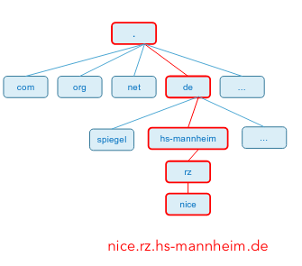

## Delegation und Zonen
DNS Datenbank ist so groß, dass sie nicht zentral administriert werden kann
- Verantwortung muss aufgeteilt oder delegiert werden
- DNS-Namensraum in Zonen aufgeteilt
- Zonen können Domains oder Teile von Domains sein
- Bsp.: Zone _de_ deleigert Verantwortung für _Domain_ rz.hs-mannheim.de an das Rechnenzentrum der hs-mannheim, diese delegiert rz.hs-mannheim weiter an RZ.


**Resource Records**
Start of Authority (SOA) Record mit:
- Zonen-Name
- authoritativem Name-Server 
- und E-Mail Adresse

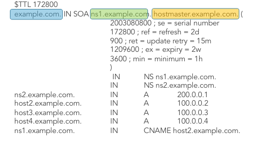

**Record-Typen**
- SOA			Start of Authority 
_parameter für diese Zone_
- A				IP-Adresse
_32-Bit-Werte_
- AAAA 		IPv6 Adresse
_128-Bit-Werte_
- MX 			Mail Exchange
_Name des Hosts, der bereit ist E-Mail für diese Domain zu akzeptieren_
- NS			Name Server
_Nameserver für diese Domain_

[detaillierte erklärung](https://www.cisco.com/c/en/us/support/docs/ip/domain-name-system-dns/12684-dns-resource.html)

## Software
- DNS-Client wird Resolver genannt
- Resolver Systemaufruf unter UNIX: `getByName(host)`
- `/etc/resolv.conf` enthält die lokale Domain und die DNS-Server für Domain
```
domain.example.com
100.0.1.10
100.0.2.10
```
- `dig` ist umfangreiches Werkzeug für DNS (löst resolver `nslookup` ab)
- Meist verwendeter DNS-Server ist BIND

## Auflösung von Domain-Namen
- _Rekursive Abfragen_
	- Anfrage wird von Nameserver zu Nameserver weitergeleitet, bis autorativer Server gefunden ist  
Beispiel hs-mannheim.de:

- Host fragt bei seinem Default Nameserver
- leitet die Anfrage für de. an einen Root-Nameserver (bspw. a.root-servers.net)
- Root-Nameserver kennt die Antwort nicht
	- weiß aber dass für TLD .de die Root-Server des DENIC verantwortlich ist
- schickt Anfrage für hs-mannheim.de an bspw. a.nic.de
- Dieser kennt die für diese Domain eingetragenen Name-Server und stellt Anfrage an einen bspw. dns1.belwue.de
- dieser liefert Antwort in Form eines A-Records auf IP-Addr 141.19.1.171
	- Ergebnis gibt er zurück an DNS-Server des DENIC der Antwort an ursprünglichen Root-Name-Server schickt

- _Itterative Abfragen_
	- nameserver erhält auf Frage jeweils eine List mit Nameservern zurück
		- Listeneinträge werden als nächstes nach ziel befragt
Beispiel hs-mannheim.de:

- Host fragt bei Default-Nameserver (der konfiguriert/per DHCP bekannt sein muss)
- leitet Anfrage für de. an einen root-Nameserver (bspw. a.root-servers.net)
- dieser erhält die Antowrt, dass für die Zone die Server des DENIC (bspw. a.nic.de) verantwortlich sind
- unser DNS-Server fragt DENIC DNS-Server nach hs-mannheim.de
	- antwortet: esg gibt 3 autorative Name-Server für Domain
- Jeder der 3 Name-Server wird Antworten:
	- A-Record mit IP-Adresse 141.19.1.171

- Client stellt rekursive Anfragen an Default-Nameserver
	- dieser kann rekursiv oder (besser) itterativ auflösen

## RFCs

**RFC 7858**
- DNS over TLS Transport Layer Secuirty  aka. DoT
- DNS-Anfragen versclhüsselt über TLS (TCP/853)
- Konkurrenzlösung zu DoH

**RFC 8094**
- DNS over DTLS (Datagram Transport Layer Security)
- wichtig um verschlüsselten Austausch zwischen DNS-Servern zu ermöglichen
- Aktuell keine weitverbreitete Implementierung

**RFC 8484**
- DNS over HTTPS aka DoH
- DNS-Anfragen werden HTTPS verschlüsselt übertragen TCP/443
- Microsoft hat in Windows 10 ab 19628.1 DNS over HTTPS DoH integriert


## Takeaway
- bei DNS handelt es sich um eine verteilte, hierarische Datenbank
- Kommunikation 
	- ist unverschlüsselt und damit weder vertraulich noch integer
	- erolgt idR. über UDP, gilt aber nur für Datenmengen bis 512 Byte
	- größere Anfragen werden über TCP versendet
- Auflösung kann iterativ oder rekursiv erfolgen
	- _rek_ liegt die Last bei angefragten DNS-Servern, wird deshalb nicht von allen unterstützt
	- _itt_ liegt Last beim Server der für Auflösung der Anfrage zuständig ist

- Unterscheidung zwischen externem und internem DNS
	- externes DNS

	- _ext_ als Besitzer einer Domain/Namensraum muss er, dafür notwendige informationen dem öffentlichen Internet zu Verfügung stellen. Mögliche Ansätze:
		- Provider DNS
			- verwaltet die Zone und bietet Schnittstelle zur konfiguration
			- Anfragen zur Domain werden vom Provider DNS beantwortet
			- Provider bietet diesen Dienst für alle seine Kunden an
			- solche Provider DNS bietet Angreifer bei Erfolg einen hohen Skaleneffekt 
		- self hosted DNS
			- Unternehmen betreibt eigenen Namenserver
			- es müssen mind. 2 Nameserver beim Registrar bzw. NIC eingetragen sein
			- es empfielt sich wegen redundanz, die Nameserver in unterschiedlichen Netzen (damit auch bei unterschiedlichen Internet-Providern) zu hosten
			- nach außen sichtbare/erreichbare Nameserver sind lediglich secondary Nameserver die von einem nicht sichtbaren und von außen nicht erreichbarem Primary Nameserver konfiguriert werden = _hidden Primary_

	- internes DNS

	- Anfragen von internen Systemen auf interne und externe Domänen oder Adressen beantworten
	- beantworten von internen Anfragen werden analog zum externen DNS (wegen Redundanz) auch mind. 2 Name-Server betrieben
			- Name Server IP-Adressen werden per DHCP an Clients weitergegeben
	- Anfragen internes System -> externe Domain sollen nicht von internen DNS-Servern beantwortet werden. Grund: Split DNS
		- soll vermeiden, dass über DNS Tunneling verdeckte Kommunikation mit Internet möglich ist (CnC-Server)


## Design
- Für interne Namensauflösung werden interne DNS-Server betrieben
- idR. primary und secondary DNS in Betrieb für hohe Verfügbarkeit
- sollen Dienste von außen erreichbar sein, muss mind. ein prim- und ein secondary DNS existieren
- DENIC lässt keine Domäneneinträge zu, welche nur ienen DNS-Server beinhalten
	- idealer weise ist jeder DNS-Server in einegenem Netz
	- Nutzt man verschiedene Provider, betriebt man idR. in jedem dieser Netze einen Server. Welcher als Primary- oder Secondary-DNS agiert ist egal

**Hidden Primary**
Primary enthält autoritative DB (zum sec. werden Daten repliziert) deshalb ist primary ist beliebtes Angriffsziel  
Lösung Hidden Primary:

**Aufbau**
- ein weiterer DNS (eigentlicher prim.)
	- in besonders isolierten, geschützten Zone e.g. DMZ 
	- versorgt offiziellen Primary mit Daten
**Nutzen**
- Werden Datensätze regelmäßig repliziert, hat ein Angreifer nur für die Dauer dieses Intervalls die Möglichkeit durch das Kompromitieren einen der externen DNS-Server die Daten zu manipulieren 
- wurde der DNS-Server durch eine Lücke in der DNS-Software kompromitiert, kann der Angreifer jederzeit und nach jeder Synchronisierung das Einfallstor nutzen
	- DNS Software aktuell halten
	- nach Unregelmäßigkeiten auf DNS-Server suchen
		- zB. Vergleich DNS-Anfragen udn Antworten auf den Hidden-Prim. und den beiden externen DNS-Server

**View**

- idR. möchte man nicht in jedem IT-System, dass auf den gesamten, internen Namensraum zugreifen darf
- um für unterschiedliche Namensräume keine eigenen DNS-Server betreiben zu müssen, gibt es konfigurierbare _Views_
- ein View gibt dem Anfragenden System nur Antworten aus dem Namensbereich, für den dies durch eine Positivliste an IP-Adressen erlaubt ist
- idR. verwendet man keine einzelnen IP-Adressen sondern definiert IP-Netze was wiederum eine entsprechende Segmentierung voraussetzt


**Split-DNS**

- Alle (bis auf wenige) IT-Systeme in Unternehmensnetzen sollten von ihrem bekannten, internen DNS-Server nur Namen aufgelöst bekommne, die zu internen Systemen gehören
- Oft leitet ein interner DNS-Server, der auf eine Frage auf Namensbereiche die er nciht selbst geben kann, an einen externen DNS-Server weiterleitet (_Forward_)
- so können interne Systeme auch DNS-Informationen aus externen Namensräumen finden
	- diese können neben IP-Adressen auch viele weiter Informationen enthalen bspw.TXT-Records
- Damit ist auch möglich, dass ein Angreifer mit der Außenwelt kommuniziert
	- bspw. ein CnC-Server per DNS-Tunneling
- Praxistipp: 
	- auf der cli ping auf extene Adresse ausführen, kommt ein e IP-Adresse zurück, ist es ein Hinweis dafür dass kein Split DNS verwendet wird und eine entsprechende Schwachstelle existiert


# DNSSEC
<details>
<summary>dnssec deails</summary>
 
ausgeschrieben: Domain Name System Security Extensions
- Reihe von Internetstandards, die DNS um Sicherheitsmechanismen erweitern 
- Ziel ist es Authentizität und Integrität der Daten zu erlangen
- DNS-Teilnehmer kann verifizieren, dass die erhaltenen DNS-Zonendaten identisch sind mit denen, die der Ersteller der Zone autorisiert hat
- wurde gegen Cache Poisoning entwickelt
- sichert die Übertragung von Resource Records durch digitale Signaturen
- Authentifizierung von Server oder Clients findet nicht statt
</details>

## Herausvorderungen
<details>
<summary>ziel und rfcs</summary>
 
Ziel ist es DNS Anfragen zukünftig verschlüsselt und nicht manipulierbar zu übertragen. Damit würde injizierung anderer Datenpakte unterbunden werden (DNS Cache Poisoning)
- im default ist die gesamte kommunikation unverschlüsselt
- RFC 8094 (DTLS) gehört zur kategorie experimentell
- RFC 7858 (TLS) wird häufig als DNS over TLS DoT bezeichnet 
- BIND bietet heute noch kein DoT
</details>

## Lösungen
- in Unternehmen spielt es keine Rolle ob lokale Anfragen im klartext übertragen werden
- bei Übertragung der Anfragen richtung Internet kann man das theoretische Risko annhemen, dass Angreifer Insider-Informationen über aufgelöste Namen erlangen
- Wichtige Merkmale für DNS sind:
	- Vertraulichkeit - DoT, DoH
	- Integrität - DNSSEC
- Im Idealfall betreibt ein Unternehmen einen eigenen Resolver und verlässt sich nicht auf Dienstleister

**Verfügbarkeit**
- Name-Server müssen immer verfügbar sein, damit Dienste hinter den IP-Adressen erreichbar sind
- für eine Domain/deren Namensraum müssen beim Registar immer mind. 2 Name-Server angegeben werden
	- beide sollten nicht im selben netz und am besten bei verschiedenen Providern sein
- änderungen werden nur am Primary durchgeführt und dann auf den Secondary gesynct
- da Name-Server immer exponiert sind, besteht das Risiko, dass diese Opfer eines Angriffs/manipuliert werden
- mit einem hidden proxy sorgt man aus einer geschützten Zone/DMZ für die aktualisierung der Name-Server

**Integrität**
- mit DNSSEC gibt es die möglichkeit DNS-Antowrten auf integriätt zu prüfen
- die Antworten erhaltne eine Signatur die es dem Resolver ermöglicht:
	- die Authentizität der Antwort auf Basis einer PKI zu prüfen
	- die Intigrität der Antwort zu validieren

**Vertraulichkeit**
- Heute werden DoT bzw. DoH von den Root-Servern nicht unterstütz
- es gitb eine Reihe von Anbietern die DoT bzw DoH anbieten
- Anbieter selbst wiederum lösen die Anfrage auf klassischem Weg auf
- einzelne Anfragen verschwinden in der Masse der anderen Nutzer Anfragen
	- es ist mit einfachen Mitteln nicht nachvollziehbar welchen Weg die Anfragen nahmen (auch nicht bei beobachtung von aus- und eingägen)

# LDAP Leightweight Directory Access Protocol
Ist im OSI in Layer 5 (Application Layer)
- Nutzerdatenbank findet Anwendung wo die einfache verwaltung von Nutzern angebracht ist
- Nutzerdatenbank hat in ihrer einfachsten Form eine flache Struktur
	- lediglich Abhängigkeit zwischen Einträgen abgebildet
	- dadurch sind bspw. Zusammenfassungen in Gruppen möglich


<details>
<summary>Beispiele</summary>
 
- windows NT 4.0 Domäne										`border:/root # cat /etc/passwd`
- lokale Benutzer unter windows						`root:x:0:0:root:/root:/bin/bash`
- /etc/passwd & /etc/groups unter unix		`daemon:x:2:2:Daemon:/sbin:/bin/bash`
(nächste Folie: 4)
- windows NT 4.0 Domäne										`border:/root # cat /etc/group`
- lokale Benutzer unter windows						`root:x:0:`
- /etc/passwd & /etc/groups unter unix		`daemon:x:2:`
</details>
 
## Vor/Nachteile
- einfach zu verstehen und einfach zu implementieren
- skaliert nicht: unübersichtlich, keine Delegation

Nutzerverzeichnis ist in Form eines Baums
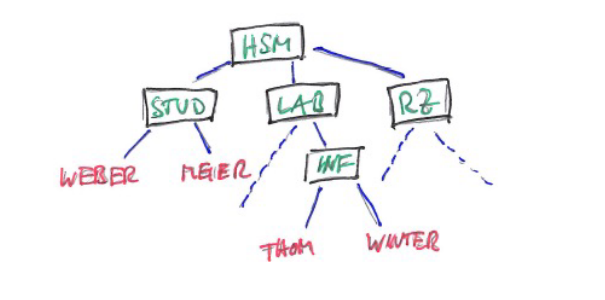

- LDAP ist ein Protokoll zur Abfrage von Daten eines Verzeichnisdienstes
- Aktuelle Version LDAPv3 ist in RFCs 4510 bis 4519 definiert
- LDAP Server ist Verzeichnisdienst (Directory Server)
	- kann durch LDAP protokoll Abgefragt werden
	- interne Struktur entspricht LDAP Spezifikation
- LDAP erlaubt es sich an einem Server anzumelden (LDAP-Bind)
- Suchabfragen zu tätigen
- Änderungsabfragen zu tätigen
- bekannteste Implementierung 
	- OpenLDAP
	- Microsoft Active Directory

## Verzeichnis
- LDAP-Server speichert Daten in Baumstruktur: _Directory Information Tree_ (DIT)
- Struktur des DIT wird durch genormtes, modulares LDAP-Schema festgelegt
- Eintrag im DIT ist ein LDAP Objekt
	- dieses gehört zu einer oder mehreren Objektklassen
	- legt fest welche Attribute im Objekt zwingend oder optional vorhanden sind
	- Attribute haben festelegte Namen und kann mehrere Werte enthalten
		- Namen sind zb. 
		-	'dc' (domain component)
		- 'cn' (common name)
		- 'ou' (orga. unit)
		- 'sn' (surname)

- Jedes Objekt besitzt auf seiner Hierarchieebene eindeutigen _Relative Distinguisehd Name_ RDN
- Zusammenfassung des RDNs eines Objekts mit RDNs übergeordneter Objekte bis zur Wurzel ist der _Distinguished Name_ DN
	- Jede DN ist eindeutig im DIT
		- Beispiel für DN: cn=jdoe,ou=schema,dc=example,dc=com
- Objekte können mit LDAP Data Interchange Format LDIF dargestellt werden (ascii)

# Basisdienste - AD
Active Directory 
## Aufbau
- mehr als einfacher Baum, eher Sammlung von Bäumen:
	- Gesamtstruktur
	- Struktur
	- Domäne
	- Organisationseinheit
	- Objekte
			- Benutzer
			- Computer
			- ...

## Domäne
- abgeschlossenes Verzeichnis von Objekten
- tree besteht aus Organisationseinheit (OU) und Objekten
- Domäne hat einen Domain Name

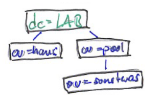

## Orga. Einheit OU
- untercontainer einer domain (Knoten im Baum/sub-tree)
- OU kann sowohl OU als auch Objekte (Computer, Benutzer, ...) enthalten 


## Objekte
- sind nicht unterteilbar
- sind die kleinste Einheit (Blätter am/im Baum)
- stehen für Netzwerkressourcen

## Sicherheit
- heute am weitesten verbreiteter Verzeichnisdienst
- in windows welt authentifizieren sich die domäne benutzer mit ihrer Anmeldung am Rechner gegenüber dem AD
	- anfallende informationen werden lokal auf rechner gespeichert
	- angreifer mit Zugang zum Rechner haben die möglichkeit diese Daten zu verwenden um sie für Anmeldung an weiteren systemen, für die der benutzer berechtigt ist zu verwenden (pass the hash)
	- nutzen admins rechner mit admin acc, kann Angreifer analog zu oben  die kontrolle über die gesamte ad infra übernehmen (golden ticket)
- trotz maßnahmen durch ms besteht gefahr noch
	- amdins sollten niemals benutzer mit oben genannten rechten verwenden

- der/die Server die als sogn. Domain-controller arbeiten stellen Herzstück des AD dar, sind also besonders zu sichern/beobachten
	- oben beschr. angriffe folgen einem bestimmten Muster. Kann mit bestimmten Auditierungsvorgängen erkannt werden
	- zusätzlich alle relevanten ereignisse an einer zentralen stelle (SIEM) zur weitern auswertung sichern
- der/die Domain-Controller sind im netz zu isolieren/kontrollieren
	- nur dedizierte server bspw. Terminal Server darf admin zugriff bekommen

# RADIUS
- NAS Network Access Server 
	- NAS ist ein Server, der Dienste in einem Netzwerk zB. dem Internet zur Verfügung stellt

## Anwendungsmöglichkeiten
- Agent, Pull und Push Sequenz
- Agent
	- entfernter Benutzer meldet sich beim RADIUS Server an
	- dieser autorisiert die vom entfernten Benutzer gestellte Anfrage und teilt dem NAS mit, dass dieser die angefragten Dienste zur Verfügung stellen soll
	- Daraufhin kann der entfernten Benutzer direkt auf den NAS zugreifen

- Pull
	- RASIUS Server befindet sich in dieser sequenz hinter NAS
	- NAS informiert sich bei RADIUS über Rechte des entfernten nutzers
	- Nutzer kontaktiert den NAS direkt
	- NAS 'bezieht' Autorisierung vom RADIUS Server (daher pull)
	- am ende verbindet oder trennt NAS den Nutzer

- Push
	- Benutzer befindet sich zwischen NAS und RADIUS
	- Benutzer stellt bei RADIUS anfrage, bekommt token
	- Benutzer gibt Token an NAS weiter (daher push)

RADUIS Pakete dienen zur Übertragung von Daten und Einstellungen.
Detailliertere Ansicht darauf was die Pakete machen:
- Access-Request
- Access-Accept
- Access-Reject
- Access-Challenge

Inahlte des Attribut und Werte des Feldes:
- Atribut-Werte Paare AVPs attributes-value paris dienen zur eigentlichen Übertragung von Informationen zwischen client und RADIUS
	- Code						|
	- Identifier			|-> Attributes and Values (varriiert)
	- Length					|
	- Authenticator

	- AVP
			- Number
			- Length
			- Value (je nach Attribut Nummer)
	
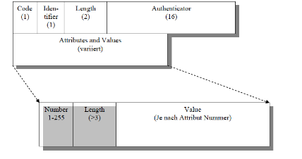

## Grundlegende Funktion

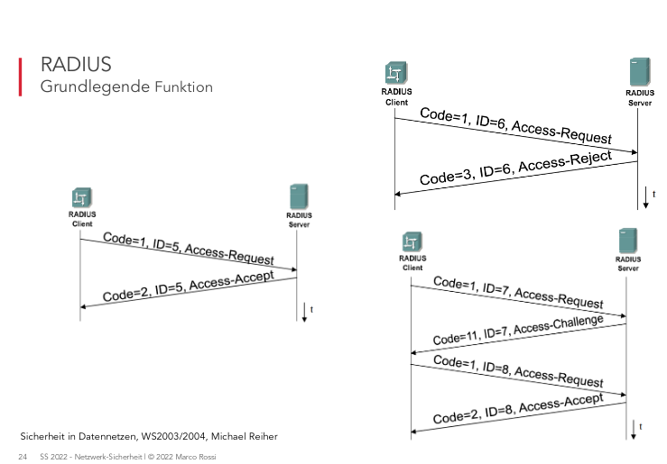

## Sicherheit
- Historisches Protokoll das heute immernoch Anwendung findet
	- gibt noch keine praktische/sinnvolle Alternative
- Vertraulichkeitsniveau ist niedrig, da verschlüsselung überholt ist (impl. md5)
	- Netze über die RADIUS überträgt sollten isoliert und kontrolliert werden
- klassischste Anwendungsszenario ist der VPN-Zugang über dediziertes Gateway/Router bzw. Firewall bei dem die Pull sequenz zum einsatz kommt
- Zugriff auf Benutzerdaten erfolgt in der Regel über LDAP kann auch auf loker DB basieren

# PKI/SSL, Verschlüsselung 
**Nutzen**
Bedrohungsszenario
- WLAN (unverschl.)
- LAN-Kommunikation
- WAN-Kommunikation
- 'Abhören' von Kabeln (physisch)
- 'Abhören' von elektromagnetischer Abstrahlung (Side Channel Attack)

Problem: Opfer bemerken nicht dass sie abgehört werden 

## Symmetrische Verschlüsselung
- sym krypto Verfahren kennen Sender und Empfänger den Schlüssel
- Schlüssel ist bitfolge mit fester Länge (zb. 256bit)
- Nachrichten die mit schlüssel k verschlüsselt werden, können nur mit Hilfe von k wieder entschlüsselt werden (bidirektional)
- Bsp. AES, Blowfish, Twofish (historisch: (3)DES, RC4)

**key exchange**
- damit verschlüsselung stattfinden kann, brauchen beide parteien Schlüssel -> _Schlüsselaustauschprotokoll_
- Bekanntestes bsp.: DH Diffie Hellmann
	- schlüssel wird nie im ganzen übertragen, trotzdem bekommen alice und bob den gleichen schlüssel

Bedrohung: MitM
- dritte partei fängt kommunikation zwischen alice und bob ab und kann alles mitlesen
- Beispiele:
	- kabel zwsischen zwei netzwerksystemen aufschneiden 
	- arp spoofing (angriff im selben LAN Segment)
	- WLAN Highjacking (hotspot)
	- BGP Hijacking (Internet Routen, vgl. Youtupe/Pakistan 2008)
- Gegenmaßnahme: weiteres/externes Wissen ist notwendig
	- genügt wenn einer der beiden parteien ein sicheres Merkmal des anderen kennt (vgl. AKE Authenticated Key Exchange)

## Asymmetrische Verschlüsselung
- seperate Schlüssel für alle Paare von Kommunikationspartnern sind oft nicht möglich
- bekannte pubkey verfahren: RSA, ElGamal, ECC Algorithmen
- jeder benutzer hat priv and pub key
- was mit pubkey verschlüsselt wird, kann nur mit privkey entschlüsselt werden

**Digitale Signatur**
- Public Key krypto kann auch umgekehrt genutzt werden
	- was mit dem privaten Schlüssel verschlüsselt wurde, kann nur mit dem passenden öffentlichen Schlüssel entschlüsselt werden
	- kann ein Empfänger die Nachricht mit öffentlichlichem Schlüssel entschlüsseln, kann er davon ausgehen, dass die Person, der pubkey gehört, absender ist

**Hashfunktion**
- Pubkey krypto ist rechenaufwändig -> langsam
- Techniken für digitale Unterschriften werden oft mit kryptographischen Hashfunktionen kombiniert
- hashfunktion bildet string beliebiger länge auf string fester länge ab
- "bei einer kryptografischen hashfunktion ist es nicht möglich eine kollision zu erzeugen" sinngemäße zusammenfassung folie 19. Eine solche hashfunktion (mit beliebiger eingabe ist nicht möglich)
- aktuelle 'kollisionsresistente' hash implementationen:
	- SHA-2, SHA-3 (wahrsch. von 2^n/2 kollisionsresistent), Whirlpool, TIGER, FORK-256
- Historisch nicht Kollisionsresistent
	- HA-0, MD4, MD5, RIPEMD, Snefru, HAVAL, SMASH

Digitale Unteschrift mit Hash
- nachricht (verschlüsselt oder unverschlüsselt) wird gehashed
- hash mit pubkey des absenders verschlüsselt
- Nachricht und verschlüsselter Hash versendet
- Empfänger entschlüsselt hash mit absenders pubkey
- Empfänger hashed nachricht
- vergleicht beide Hashes -> stimmen überein bedeutet signatur valide

## PFS Perfect Forward Secrecy
- eigenschaft bestimmter Schlüsselaustauschprotokolle, neben den Langzeitschlüsseln für jede einzelne Sitzng einen Schlüssel vereinbaren
- ex existiert dann eine PFS wenn nach dem Ende dieser Sitzung der verwendete Session Key nicht mehr aus den Langzeitschlüsseln rekonstruiert werden kann
- aufgezeichnete verschlüsselte Kommunikation auch bei späterer Kenntnis des Langzeitschlüssels nicht nachträglich entschlüsselt werden

## PKI
### Klasse 1
- von Zertifizierungsstelle erstellte Zertifikat sichert die angegebene E-Mail Adresse zu

### Klasse 2
- Zertifikat sichert ide Echtheit der angegbenen E-Mail Addr. sowie den dazugehörenden Namen zu
- falls relevant auch das Unternehmen
- Verifizierung der Angaben findet über Drittdb oder Ausweiskopie statt
 
### Klasse 3
- unterscheidet sich von 1 und 2, da sich Antragsteller persönlich ausweisen muss

### X.509 PKIX Cert
Cert:
- CN= ... Extended Validation SSL SGC CA
	- 1 Jahr valide

Sub:
Issuer:
- CN= ... Primary Certification Authority
	- 10 Jahre valide
Subject:
- CN= ... Extended Validation SSL SGC CA

Root:
- CN= ... Primary Certification Authority 
	- 25 Jahre valide

### Revocation
- geheime Schlüssel können kompromitiert werden
- Zertifikat muss daraufhin ungültig gemacht werden
- Typisches vorgehen:
	- Zertifikat haben eingeschränkte lebenszeit
	- wenn sie während dieser Zeit ungültig werden
		- melden beim Herausgeber/issuer des Zertifikats
		- dieser setzt Zertifikat auf Certificate Revocation List (CRL)
		- Die CRL wird regelmäßig bekanntgegeben
		- oder man fragt immer vor Annahme eines Certs beim Herausgeber nach ob es auf dieser Liste steht (OSCP)

- CRLs sind als URI im Zertifikat selbst hinterlegt
- Darüber kann man Zertifikate als ungültig erklären
- OCSP Online Certificate Status Protocol bietet die Möglichkeit vor dem akzeptieren des Zertifikats, dessen aktuelle Gültigkeit zu prüfen
- Die URL bzw. die Adresse des sogn. OCSP-Responders ist analog zur CRL im Zertifikat des Herausgebers zu finden

### SSL/TLS
- das heute für eine PKI wahrscheinlich wichtigste Anwendungsgebiet im Internet sind verschlüsselte Verbindungen zu Internet-Servern
- Gängigste Technik: SSL bzw TLS
- Protokolle zum Authentifizieren und verschlüsseln von tcp Verbindungen
- SSLv2 wurde ursprünglich von netscape entwickelt und später zu SSLv3 weiterentwickelt
- Von der IETF nochmals weiterentwickelt und standadisiert als TLS
	- SSLv2 und v3 werden heute (hoffentlich) nirgendwo mehr eingesetzt
	- TLS1.0 udn TLS1.1 gelten als nicht mehr sicher
	- TLS1.2 ist heute am weitesten verbreiteter Standard
	- TLS1.3 ist der aktuellste und streitbarste Standard

- TLS 1.3 ist der neuste Standard
- in TLS 1.3 gibt es keinen RSA-Schlüsselaustausch mehr
- Sitzungsschlüssel wird ausschließlich über Dh ausgetauscht 
	- damit ist PFS erreicht
- Cipher Suiten wurden ausgemistet - nur noch 5 Stück
- 'MAC-then-encrypt' durch 'Authenticated encryption with Associated Data (AEAD)' ersetzt
- Freigabe von TLS 1.3 gab es Forderungen aus bestimmten Bereichen der Politik, den Abhörstandard Enterprise TLS (eTLS) is das TLS 1.3 einzubauen
- Im Falle von Ermittlungen sollte es die Möglichkeit geben bereits aufgezeichnete und verschlüsselte Daten nachträglich zu entschlüsseln

**Technik**
- SSL bzw. TLS sind (teilweise) unnötig komplexe Protokolle
- wesentliche Grundlagen/Prinzip von SSL/TLS:
	- Zusätzliche Protokollschicht zwischen Transport und Anwendungsprotokoll
	- implementiert im Userspace (typischer weise in bibliothek zb openssl)
- nutzt eine darunterliegende 'normale' TCP Verbindung verlässt sich insberondere auf Zuverlässige und Reiehnfolgeerhaltung durch TCP
- Einer der häufigsten Anwendungsfälle
	- https = http üer SSL/TLS über TCP über IP über:::

- Webserver verwenden Zertifikate um sich gegenüber dem Anwender auszuweisen
- Clients müssen sich mit einem Zertifikat gegenüber ienem Webserver ausweisen
- IP Stack mit SSL/TLS

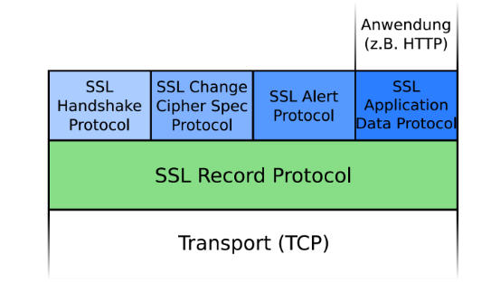 

- SSL/TLS Handshake

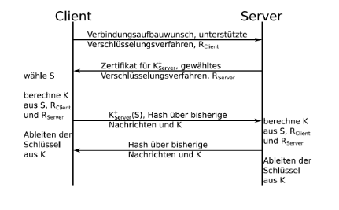 

## Takeaway
- kryptografische verfahren werden benutzt um Informationen vertraulich und damit geschützt zu übertragen
- für die verschlüsselung werden symmetrische verfahren genutzt
	- Schlüssel muss allen teilnehmern bekannt sein
	- musss trotzdem geheim sein

- symmetrische Alogs lassen sich effizient in soft oder Hardware abbilden
	- werden deshalb auch Transportverschlüsselung genannt
- Asymetrische Verschlüsselung erlaubt es bei dem Austausch von verschlüsselten NAchrichten den dafür öffentlichen Schlüssel (pubkey) offen zu verteilen
- bei assymetrischer verschlüsselung wird die nachricth mit pubkey des emfpängers verschlüsselt

- um manipulation zu erkennen benötitgt man (kryptografische) hashverfahren
-	zu jedem bel. Eingangswert bzw. Datenmenge lässt sich mit einer Hashfunktion ein einmaliger Ergebniswert fester länge abbilden 
- aus dem Ausgangwert lässt sich der Eingangswert nicht mehr zurückrechnen
- bei allen Algorithmen besteht die Gefahr der kollision = unterschiedliche Eingabewerte führen zum selben ausgangswert
	- eine gute hashfunktion zeichnet sich dadurch aus, dass sie nur wenig Kollision erzeugen

- Das populärste Protokoll für Verschlüsselung ist Secure Socket Layer SSL bzw Tansport Layer Security TLS
- TLS hat SSL als Namen abgelöst und sollte in der Regel durch das Diffie Hellman DH Verfahren
- Für eine durch TLS gesicherte Verbindung zählt ebenso dass die für die verschlüsselung genutzten symmetrischen Schlüssel in regelmäßigen und kurzen Abständen ausgetauscht werden
- mit dieser sogn. PFS Perfect Forward Secrecy können im Nachhinen keinen Schlüssel von einem System entwenden nachträglich auf aufgezeichneten Datenverkehr zur entschlüsselung angewendet werden
- TLS findet heute in vielen Standardprotokollen seine Anwendung SMTP/s, IMAP/S, LDAP/S, DoT

- Jegliche kommunikation sowohl intern als auch extern sollte in einem unternehmen wann immer technisch möglich verschüsselt werden
- es gibt keinerlei technische Gründe dies nicht zu tun
	- oftmals wird als argument verwendet dass man bei der fehlersuche in verschlüsselten protokollen eingeschränkt ist
	- im umkehrschluss bedeutet die, dass ein Angreifer, der sich über einen längeren Zeitraum im Netz befindet, die möglichkeit hat unkompliziert an datan zu kommen die übertragen werden
- gerade im bereich email wird oft auf Grund von unwissenheit oder dme zu erwartenden Aufwand darauf verzichtet, diese per Zwangsverschlüsselung zu übertragen obwohl dies einfacher ist als durch komplexe dedizierte emaliverschlüsselungsmethode 

- Innerhalb einer Pubkey infrastrukt werden ausschließlich asymetrische Schlüssel verwendet
- bei einer PKI handelt es sich um eine hierarchische Struktur die auf dem Vertrauen der einzelnen Zweige auf dem darüber liegenden basiert (trust chain)
- oberste instanz wird als root ca (cert authority) bezeichnet
- wie jedes andere Zertifikat auch besteht sie aus Schlüsselpaar aus priv- und pubkey
	- nur privkey wird zum signieren anderen, darunterliegenden zert verwendet
	- ist besonder schützenswert und und sollte nie direkt zum signieren verwendet werden
	- an seiner stelle tritt in der praxis die signing ca oder intermeidate ca
	- laufzeit bzw gültigkeit der oort ca liegt über der, der signing ca
	- gültigkeitsdauer hägt von der länge des kryptografischen schlüssels und dem vertrauen in die robustheit des algorithmus ab
- in unternehmen finden sich immer mehr apps welche per browser bedient werden können
- in der regel haben diese häufig transportverschlüsseung in form von https
	- bzw. schließen http völlig aus
- damit app funkitoniert benötigt sie ein ssl zert welches häufig zum zeitpunkt der installtion erstellt wird
- solche self signed zerts führen dazu, dass beim ersten aufruf der anwendung eine Warnmeldung des browsers aufruft -> muss übersprungen/akzeptiert werden um zugang zu erhalten
- insgesamt führt dies zu einem unsensiblen verhaltne der mitabrieter, da es diesen schwerfällt zu unterscheiden was technisch bedingt ist oder sich ggf um einen Angriff handelt
- jedes unternehmen sollte daher eine eigene PKi etablieren und im rahmen von neuen projekten dafür sorgen, dass überall dort wo transportverschlüsselung möglich ist, ein von der Unternehmens CA signiertes Zertifikat zum einsatz kommt
- Auf diese Weise ist es jedem nutzer möglich bei einer Fehlermeldung adäqut zu reagieren un beim support einen potenziellen Angriff zu melden

# Firewalls I
Was kann FW nicht:
- vor bösartigen insidern schützen
- vor verbindung schützen die nicht durch sie hindurchführen
- vor neuen Gefahren schützen *
- Im allgemeinen nicht vor Viren und Verkehrs-Anomalien schützen
- Entgeräte-Sicherheit ersetzen
- sichere Kommunikationverfahren end-to-end ersetzen
	- Verschlüsselung, Authentifizierung, digitale Signaturen

## Paketfilter Technologie
Paketfilter befinden sich im OSI Modell auf Layer 3 und 4 (Network und Transport Layer)
	- hier findet Überprüfung der Sende und Empfangsadresse statt
	-	überprüfung der protokollart
	- des protokoll ports
	- der benutzerspzifischen Bitmaske
 
- Steuert selektiv den Datenfluss von und zu einem Netz
- Lässt Pakete zwischen zwei Netzen passieren oder blockiert sie
- ein vorher aufgestelltes Regelwerk, die Access Control List ACL selektiert die Pakete
- wird mit hilfe von Routern ACL oder auch Hosts realisiert

Selektionskriterien
- IP-Quell-/Zieladresse
- Protokoll (ob es TCP-/UDP- oder ICMP Paket ist)
- TCP- oder UDP- Quell-/Zielport
- Kontrollbits im TCP- Segment
- ICMP Nachrichtentyp
- In-/out-Schnittstelle eines Pakets
- es gibt 2 verschiedene Herangehensweisen (policies)
	- es ist alles erlaubt, was nicht ausdrücklich verboten ist
	- es ist alles verbotne, was nicht ausdrücklich erlaubt ist

Bsp. SMTP-Verkehr eingehend:
- Richtung: IN ->
- Zielport: 25

- Richtung: OUT <-
- Zielport: > 1023

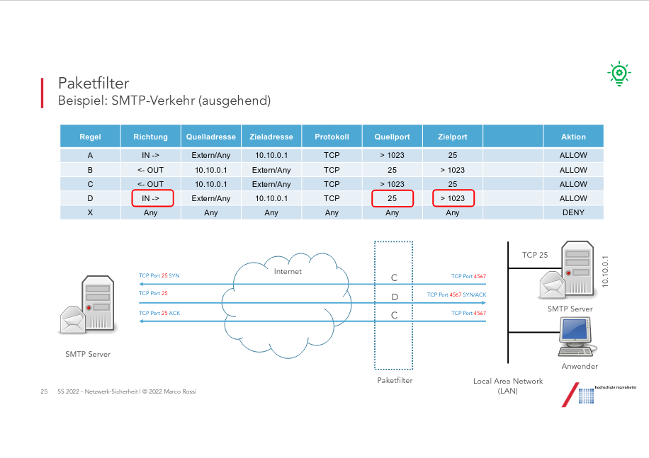

- Vorteile
	- durch paketfilter kann man sehr einfach selektiv bestimmte dienste, Rechner oder ganze Teilnetze freischalten
	- die kosten für eine solche Lösung sind sehr gering, fast alle Router haben derartige filterfunktionen schon eingebaut
	- technischer Aufwand der für die Lösung betrieben werden muss, ist ebenfalls im unteren Bereich anzusiedeln
	- Für den Benutzer stellt sich ein Paketfilter meist völlig transparent dar

- Nachteile
	- filterregeln können bei größeren Netzen sehr schnell unübersihctlich werden (schmälert sicherheit)
	- überprüfung der Regeln ist meist sehr aufwendig
	- es stellt sich mit dem potentiellen angreifer nru eine Sicherheitsbarriere in den Weg, danach ist das ganze lokale Netz ungeschützt
	- es kann keine Kontrolle der Nutzdaten erfolgen

## FTP
im OSI model im layer 5 Application
- es gibt active und passive mode

## Bastion Host
- erster oder einziger Rechner der aus dem Internet erreichbar ist
- höste Hostsicherheit ist erforderlich
- Softwareausstattung sollte so einfach wie möglich gehlaten werden
- Erbringt und leitet Internetdienste weiter
- Benutzer Accounts sollten nicht eingerichtet werden
- darf nicht die funktionalität eines Routers erfüllen
- Übernimmt oft die Protokollfunktionen (loggin/audits)

## Dual Homed Host
- vereinigt Gateway und Paketfilter
- darf allerdings kein Routing möglich sein
- Arbeitet auf Anwendungsebene

### Vorteile
- es kann eine vollständige Kontrolle der Verbindungen erfolgen, da auf Anwendungsebene gearbeitet wird
- Konfigurationsaufwand hält sich in grenzen da nur ien Rechner die FW bildet
- die Kontrolle der Verbindung kann hierbei inhaltsbezogen durchgeführt werden
- es kann die identität der dahinterliegenden Rechner verborgen werden

Nachteile
- mehraufwand, da für jeden Internetdienst, evtl. ein eigener Proxy server installiert werden muss
- fw verhält sich dem benutzer gegenüber nicht mehr transparent
- clientprogramme müssen dafür ausgelegt sein
- nur der dual homed host trennt netz vom internet so ist bspw. ein abhören der internen kommunikation möglich falls der host kompromitiert wurde
- es müssen evtl. leistungseinbußen durch den porentiellen engpass der dual homed host in kauf genommen werden

### FW Systeme heute
- komfortable Nutzung (über UI)
- stabile mechanismen für aktualisierung und Hochverfügbarkeit
- hohe durchsatzraten (100Gbit/s)
- Gehärtete purpose build Appliances
- enterprise: Firewall only + dedizierte Proxies/Dienste
- MidSize: UTM Firewall

Bekannte Vertreter:
- check point fw-1
- cisco asa
- palo alto networks
- fortinet fortigate
- barracuda
- sonic wall
- sophos utm/xg
- WatchGuard 

Architektur
- eigene DMZ je Risiko-Klasse
- 2-stufige Strukturen
- Firewall pro Strukturschwerpunkt bspw. VPN-FW, WAN-FW, DC-FW
- IN = WWW, SMTP, FTP
- OUT = HTTP, SMTP

## Sicherheit
- eine fw stellt das mindestmaß an sicherheit in modernen Netzen dar
- bietet jedoch als einzellösung im jahr 2020 keine nausreichenden Schutz mehr
- die fw segmentiert die an sie angebundenen Netze
- Netze welche besondere Bedeutung haben bzw welche in Richtung unbekannter Netze exponiert sind, bezeichnet man als DMZ (demilitarisierte Zone)
- Alle in einer FW befindlichen Regeln sollten nummeriert und dokumentiert sein
- das Ergänzen und Löschen von FW Regeln sollte immer durch einen mehrstufigen Gehenmigungsprozess laufen
- es existieren Lösungen die obige Vorgaben in software abbilden und als Intermediär zwischen Administration und fw agieren
- sie protokollieren jede Änderung bzw erhalten ihre Änderungen aus übergeordneten systemen
- regelmäßige fw audits sollten dafür sorgen, dass regeln und deren gültigkeit bzw. notwendigkeit unabhängig überprüft werden

# Firewalls II
## Stateful Packetfilter
ist im OSI model auf layer 4 Transport layer
- überprüft:
	- sende und empfangsadresse
	- protokllart
	- protokoll-ports
	- benutzerspezifische bitmasken
	- Verbindungsdaten

- Der Paketfilter merkt sich in einer Tabelle die Verbindungen die er aufgebaut hat
- nur eine übersichtliche Regel, die die Kommunikationsbeziehung vollständig darstellt und abbildet

**Stateful inspection**
- analysiert das Protokoll nicht nur hinsichtlich Verkehrsfluss sondern auch auf Inhalte der übertragenen Daten
- Inhalte von dynamischen Protokollen bspw. Passive FTP können für dynamische Paketfilter verwendet werden

Vorteile:
- dynamische Regeln für dynamische Protokolle zb. MS-SQL, FTP, H.323, SIP  
  
Nachteile:
- keine Überprüfung der Inhalte/Protokoll sondern lediglich Auswertung der Parameter
- keine Analyse bei verschlüsselten Protokollen möglich


## ALG Application Level Gateway 
im OSI auf layer 5 application Layer
- Fungiert als Proxy
- Für jeden über die Unternehmens-policy freigegeben dienst muss ein eigener Proxy auf der FW angelegt sein
- Können in den Datenpaketen zb FTP auch einzelne Befehle unterbinden zb. nur GET, kein PUT

Vorteile
- vollständige Analyse des Protokolls und Anwendungen von Detektions- und Filtermechanismen
- einfache Integration in FW möglich (UTM - Unified Threat Management FW)

Nachteile
- nur wenig Protokolle vollständig unterstützt
- Generische Proxy Funktion nicht viel mehr als NAT
- Anfällig gegenüber Protokollschwachstellen analog zum zu schützenden Dienst selbst
- Rikito dass über obige Schwachstellen Zugriff auf die gesamte FW eroflgen kann

## Hybrid FW
sind in OSI auf Layer 3 - 5, Network, Transport und Application Layer
Layer 3
- Für protokolle die ein geringes Sicherheitsrisiko beinhalten
- es reicht eine einfach Paket filter Funktion
- beschleunigt den Datendurchsatz erheblich

Layer 4
- Für Protokolle wie HTTP oder SMTP, bei denen ein hohes Datenvolumen vorausgesetzt wird
- stateful inspection technologie
- für zusätzliche Sicherheit müssen/sollen Schnittstellen zu AntiVirus- /Contentfiltering programmen geschaffen werden
- einsatz ist verbindungsorientiert und erhöt somit die Durchsatzgeschwindigkeit

Layer 5
- für kritische Protokolle wird die Application level proxy technologie benutzt
- bietet den höschten sicherheitsschutz 
- ist langsam

**UTM Unified Threat Modeling**
- all in one Lösung die neben der klassischen filterfunktion weitere Dienste darauf hin umgestaltet
- viele große etablierte Hersteller haben um 2004 dies als innovation gesehen und ihre Produkte darauf hin umgestaltet
- Das ergebnis war ernüchternd:
	- Leistungsfähigkeit dieser Maschinen begrenzt da viele Funktionen gleichzeitig abgebildet werden mussten
	- purpose buildt Systeme - nicht x86 basierend - hatte Probleme mit einer soliden implementierung (wettbewerb und Zeitdruck)
- bei Risikobetrachtung solcher Systeme hat man festgestellt, dass es keinem guten Security Design entspricht auf einem sensiblen System wie einer FW oftmals anfällige dienste zusätzlich zu betreiben
- ~2009 war UTM im enterprise Bereich verschwunden

Voraussetzungen für UTM: keine

Vorteile:
- kompekte lösung für alle üblichen Anwendungsfälle
- schnelle Umsetzung fast aller Anforderungen und Funktionen an eine ordentliche IT- Sicherheitsinfra
- Einhetliche Adminstrationsoberfläche

Nachteile:
- idR. keine Skalierbarkeit - Hardware ist nicht modular
- Festlegung der Leistungsklasse schwierig, da die Mischung an Funktionen und die daraus resultierende Last schwer vorhersehbar ist
- Risiko auf iener Plattform unterschiedliche Dienste nach außen hin abzubilden

**Sicherheit**
- aktuelle fw unterschieldihcster hersteller arbeiten heute alle auf basis des sog. stateful packagefiltering und bieten damit auf der Ebene der Kommunikationskontrolle das Maximum an Sicherheit
- Dadurch, dass heute fast alle Kommunikation auf HTTP/S basiert ist es notwendig neben Kommunikationskontrolle auch Inhalte erkennen und reglementieren zu können
	- die meisten fw bieten dafür _Applicaiton Awareness_ welche es ermöglicht nach
		- anbieter bspw. Faceboot
		- bei anbieter genutzten Dienste zu erkennen
- mit UTM FWs haben Unternehmen die Möglichkeit durch ein angemessenes Kosten Risko Verhältnis sich mit einem Maximum an technischen Schutz und Funktionen auszustatten

# Proxy Server
**Aufgaben und Nutzen**
- an Stellen des eigenlitchen endsystems (e.g. Router/Modem) die Komunikationsverbindung zu einem bestimmten Ziel aufzubauen
- durch diese Zwischeninstanz ergibt sich die Möglichkeit Kommunikationsbeziehungen auf Applikationsebene auf Ziel und teilweise auf Inhalt zu verbieten
- zb. besteht im RAhmen der Gesetze zum Schutz von minderjährigen in Ausbildungsbetrieben die Vorgabe, Jugendlichen mit Zugang zu Computersystemen mit Internetzugang, den Zugang zu pornografischem Material zu verbieten
	- Auszubildende werden der LDAP- oder AD-Gruppe 'azubis' zugeordnet
	- proxy server besitzt eine Filterregel die den Benutzern der Gruppe 'azubis' den Zugang zu Internetadressen mit dem Merkmal 'pronografisch' verbietet

**Typen**
- SOCS Proxy
	- steht für SOCKetS = vom os bereitgestelltes Objekt das als Kommunikationsendpunkt dient
	- das SOCKS Protokoll ist ein Internet Protokoll für das es RFCs gibt
	- Anhand der RFC-Nummern 1928, 1929, 1961 erkennt man das 'Alter' und den Entwicklungsgrad
		- die letzte Änderung/ergänzung kam mit RFC 3089 im april 2001 zu IPv6
	- generisches Protokoll über das man beliebige Protokolle bedienen kann
	- Benutzerauthentifizierung für Protokolle bei denen das nicht möglich ist
	- es ist keine Inhaltskontrolle vorhanden
	- es bedarf neben der Server Komponente oft noch eines Agenten auf dem Client
		- Es sind nur wenige bereits 'SOCKSfied' apps verfügbar

- HTTP Proxy
	- unterstützt nebne dem http-protokoll auch noch https
	- der proxy server kann sowohl transparent als auch 'inline' betrieben werden
		- Transparent Mode
			- (AD) SSO
			- Agent
			- Browser
		- Inline Mode
			- (AD) SSO
			- Agent
			- Browser
			- Basic Auth
	- Die durch den Benutzer angesteuerten Web-Seiten (URLs) können über ein Regelwerk auf Themenbereiche und Benutzergruppen eingeschränkt werden
	- überHTTP transportierte Inhalte (MIME-Typen) werden auf viren untersucht
		- in moderneren Lösungen in einer Sandbox
	- es können Regeln definiert werden, die bereits das Herunterladen bestimmter Datei-Typen verbieten um damit einhergehende Risiken zu vermeiden
	- Moderne Proxy Systeme erkennen nicht nur den Datei Typ sondern können bspw. in Excel Dokumenten erkennen ob diese ein Makro enthalten oder nicht
	- mit modernen Proxys ist es ebenso möglich den verschlüsselten HTTP Verkehr aufzubrechen (SSL-Interception) und die INhalte zu untersuchen

- FTP Proxy
	- ist analog zum http proxy auf das FTP-Protokoll reduziert
	- Analog zum HTTP-Proxy kann der ftp-proxy eine Authentisierung und Filterung durchführen
	- die filterfunktion AV sind auf die übertragenen Inhalte beschränkt
	- eine Filterung und Kontrolle auf Protokollebene erfolgt nicht
		- hier wäre eine ALG die richtige Wahl

- Next Generation Web Gateway aka Cloud-Proxy oder SASE\*
	- befindet sich als SaaS in der Cloud
	- Dedizierte Anbieter solcher Dienste bieten neben den klassischen Filterfunktionen weitere Funktionen, die die Kontrolle der Zugriffe und Daten ermöglichen
		- CASB
		- DLP
	- die verbindung zum Cloud-Dienst erfolgt häufig per IPsec-VPN oder GRE-Tunnel
	- mobile Anwender haben die Möglichkeit über eine Client-Software diese Verbindung direkt vom Endgerät zur Cloud zu realisieren
		- so erhalten Anwender den Schutz, unabhängig vom Ort oder Internetzugang

## Implementierung

Standard-Proxy:
- liegt zwischen Client und Internetzugang

Reverse-Proxy:
- liegt zwischen Internetzugang und Webserver
- Client verbindet sich mit Internet, wird weitergeleitet an Proxy, dieser spricht mit angefrageten Webserver

**WAF Web Application Firewall**
- hat die Aufgabe die Client-Server Kommunikation zu kontrollieren
- web-server leisten mehr als ausliefern von Daten zur Darstellung im Browser
- web-apps bieten dem Benutzer mit dem web-server und indirekt mit dem backend zu kommunizieren
- dabei muss die web-app die übergebenen Daten richitg interpretieren
- auf Grund der komplexität von web-apps ist es schwer jeden Fehler zu erkennen
- eine WAF überprüft die Form und den Inhalt der übergebenen Daten  
	- das überprüfen erfolgt idR. durch 'Standard Policies' die die Hersteller von WAF-Lösungen mitliefern
	- Standard Policies decken die klassischen Angriffsvektoren einer web-app ab
	- dazu gehören Injection Angriffe
	- XSS Cross site scripting
	- parameter tampering
	- cookie poisioning
	- und auch direkte Angriffe auf den Web Server selbst

Vorteile
- eine WAF bietet mehrere Ebenen von Schutz und wirkt zusätzlich durch evtl. schon vorhandene Filter in der Web App selbst
- Sicherheitslücken für mehrere Applikationen hinter der WAF gleichzeitig abgedeckt werden
- durch WAF können Anwendungen geschützt werden für die es evtl. keine Updates/Sicherheitsaktualisierungen (mehr) gibt
- verwundbare Anwendungen können bis zur Verfügbarkeit einer Sicherheitsaktualisierung geschützt werden

Nachteile
- für die erstellung einer granularen policy sind genauere Kenntnisse der Web-App notwendig
- eine WAF muss immer in den Deployment Prozess der web app eingebunden werden um den Betrieb durch Overblocking nicht zu gefährden
- Anwendungen die stark auf JS basieren (AJAX) besitzen eine hohe komplexität
- Moderne Web-Apps bringen bereits eigene FW module mit (bspw. wordpress mit wordfence)
 
**Explicit/Direct**
Explicit
- client bekommt Konfigurationsinformation
	- diese weist browser an Anfragen an den Proxy zu stellen
	- NAmensauflösung und routing basieren auf den Umgebungsbedingungen des proxy servers
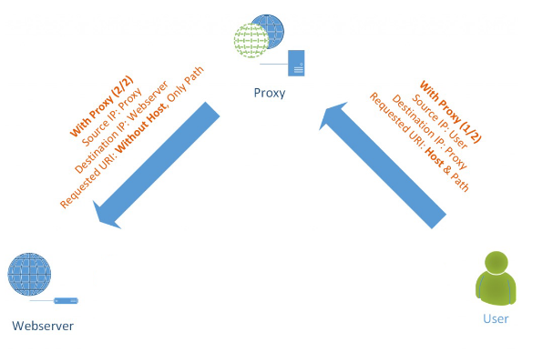

Direct (Transparent)
- Client bzw. Browser stellt anfragen direkt
	- namensauflösung erfolgt über dns-config des clients
	- routing zum zielsystem erfolgt über routing des netzwerks und den damit möglichen Übergängen in das internet
	- ist für client nicht sichtbar
	- anfragen des Clients werden per DNS lokal aufgelöst
	- Proxy server agiert wie bei einem MiTM Angriff
		- TCP kommunikation vom client wird vom proxy server terminiert
		- proxy baut mit den Informationen aus der Anfrage selbst die Verbindung zum Zielsystem auf
		- es können die gleichen Filtermechanismen angewendet werden wie bei einem Explicit proxy server

**Management**
PAC Proxy Auto Config
- PAC Dateien enthalten JS Funktion `FindProxyForURL(url, host)`
- funktion gibt einen string mit einer oder mehreren Proxyspezifikationen zurück
- mit mehreren Spezifikationen wird Fallback/Failover möglich
	- für den Fall dass ein Server nicht antwortet
	- zur Lastenverteilung nach dem 'Round Robin' Prinzip erreicht werden
- Browser holt sich PAC Datei bevor er weitere Seiten anfordert
- Bekannte Domains direkt, ansonsten Loadbalancing
```js
function FindProxyForURL(url, host) {

	if (dnsDomainIs(host, "intranet.domain.com") 
			|| shExpMatch(host, "(*.abcdomain.com|abcdomain.com)"))
	return „DIRECT";

	return "PROXY proxy1.example.com:8080; PROXY 1.2.3.4:3128";
}
```
- moderne browser bieten mehere mögichkeiten der konfiguration
	- die Art kann gewählt werden je nach Bedürfniss
- Es handelt sich üblicherweise um folgende möglichkeiten
	- _manualle proxy_
		- wahlhostname und portnr. werden angegeben, diese werden für alle URLs verwendet
		- meist können auch domains wie zB. localhost angegeben werden
	- _PAC proxy auto config_
		- durch angabe der URL einer PAC-Datei wird die Verwendung eines passenden Proxy für jede URL möglich
		- sie enthält eine JS Funktion die zu jeder Adresse den passenden Proxy aussucht
	- _WPAD - Web Proxy Autodiscovery (Protocol)_ 
		- Browser sucht sich PAC Datei selbst

# VPNs Virtuelle Private Netze
**Merkmale**
- Virtual
	- eine 'logische' Struktur
	- statisch oder dynamisch
	- unterschiedliche Technologien und techniken zur virtualisierung (des netzes)
- Private
	- Beschränkter Zugang und Zugriff
	- Mandatenfähigkeit
	- Sicherstellung von Authentizität, Integrität, Vertraulichkeit
- Network
	- Struktur auf Basis einer geteilten Infrasturktur
		- Internet, MPLS (früher FrameRelay, ATM)
	- Tunneling oder Tagging
	- Transparent oder 'nicht-Transparent' für Benutzer

**Anforderungen**
- Wirtschaftlich
	- kostengünstige Lösungen
	- Hohe Flächenabdeckung und Integration von mobilen Benutzern
- Sicherheit und Qualität
	- Vergleichbar einem privaten Netz zb. auf Basis 'leased lines'
	- flexibel, individuelles Quality of Service (QoS), Bandbreiten-Management
- Interoperabilität und Integration in Geschäftsprozessen
	- gesicherte Übergänge zu Inter-/Intra-/Extranet
	- Zugriff auf Unternehmensdaten und -anwendungen
	- Verwendung vorhandener Adressen und Adressierungsschemata
	- Transparenz (bzw. einfache Anwendung) für Benutzer

**Organisation und Nutzungsformen**
- Intranet VPN
	- Internes Netz einer Organisation/Firma
	- Verbindet e.g. Zentrale, Niederlassung, Außenstellen,...
	- Intranet ist über FW usw. vom Internet abgeschottet
- Remote Access VPN
	- Einbinden mobiler Nutzer 'road warriors'
	- Heimarbeitsplätze etc. an das Intranet über zb. das Internet
- Site-to-Site
	- Quais Standverbindung zwischen den Standorten
	- Transparent für die Benutzer/apps
	- typischerweise bei Remote Access VPN
- 'End-to-End'
	- höchste sicherheit da die Daten durchgehend verschlüsselt sind
	-kein typisches einsatzszenario aber für den fall in dem bspw die Daten vom db server der firma A auf einen Server der Firma B zur Weiterverarbeitung übertragen werden
		- heue abgelöst durch REST bzw. früher mit SOAP strukturen und SSL verschlüsselung

**OSI Schichtenmodell**
Technologien:
- layer 2
	- L2F
	-	(PPTP)
	- L2TP
	- L2Sec
- layer 3
	- IPsec (PPTP)
- layer 4
	- SSH
	- SSL/TLS
	- SSL-VPN
	- (PPTP)
- VPN technologien in WANs
	- multiprotokoll Label Switching (MPLS)
	- virtuelle verbindungen in frame relay netzen
	- virtuelle pfade und kanäle in zellbasierten netzen e.g. ATM

**Mechanismus**
- realisierung einer Schicht N+1 kommunikationsbeziehung über ein Schicht N trägernetz
- tunnel damit oft vergleichbar (mit Nutzung) einer (virtuellen) Verbindung
- Bestandteile des Tunnelmechanismus
	- passagier-protokoll
	- tunnel-porokoll
	- träger-protokoll
- kann dazu führen dass der OSI-Stack etwas 'durcheinandergewürfelt' wird, e.g:
	- ein PPTP Protokoll layer 2 wird über IP layer 3 geführt
	- ip wird in ip eingebettet

Beispiel:


ISDN | PPP | IP-Hdr | UDP | L2TP | PPP | IP-Hdr | Data |
|					Träger					|		Tunnel	 | 	Passagier		 |


**AH and ESP**
- AH auth header 
	- protokoll zur sicherstallung von integrität und authentizität
	- kryptografische prüfsumme (hash, HMAC) über IP Pakete (MD5, SHA1)
- ESP encapsuling secrutiy payload 
	- protokoll zur sicherstellung von Vertraulichkeit und authentizität
	- verschlüsselung des IP-Pakets oder Payload (3DES, SHA-1, AES-128, AES-96)
- AH und ESP könne sowohl im tunnel- als auch im transport modus verwendet werden

## OpenVPN
- nutzt SSL/TLS bib und funktionen
- läuft auf gängigen plattformen 
- volle leistungsfähigkeit bei
	- authentifizierung (psk, zertifikate) und verschlüsselung
- lässt sich gut in fw/NAT umgebung integrieren
	- benötigt nur eine tcp oder udp 'verbindung'
	- kann auch über http getunnelt werden
- bietet fast gleichen funkitonsumfang wie IPSec u.a.
	- Routing von ganzen Netzen
	- DHCP, DNS, und WINS Server
- relativ einfach zu konfigurieren GUI
	- alternative zu IPSec
- ist ein Vertreter von SSL-VPN
- jede auf SSL-VPN basierende Client-Server Kommunikation ist individuell
- Fast keine INteroperabilität zwischen Herstellern

**WAN**
- WAN-Verbindung können im vergleich zu internetverbindungen eine Bandbreitengarantie geben
- WANs haben ihre eigene Layer-2 Protokolle als Unterbau und zum Transport der Anwendungsprotokolle 
	- FF Rrame relay 
	- ATM Asynchronous Transfer Mode
	- MPLS Multi Protokol Label Switching
- WANs nutzen bereits VPN Strukturen indem die Datenleitung mit mehreren voneinander logisch getrennten Kommunikationspartnern belegen
- bei MLPS wird oft auch von MLPS-VPN gesprochen was aber keine Verschlüsselung mient sondern nur eine Trennung

**Sicherheit**
- VPN-Tech kommt überall dort zum einsatz wo Daten in logischen Kanälen über geminsam genutzte Medien bpsw Internet zwischen unterschiedlichen Standorten transportiert werden
	- heute werden ausschließlich technologien mit verschl. genutze
	- verschl. datenaustausch über landesgrenzen hinweg kann in einigen Ländern verboten werden
- vpn verbindugnen kommen auch durch Anbindung von Partnern zum Einsatz
	- Teilweise kommen für unterschiedliche Anwendungsfälle oder Risikoklassen dedizierteVPN Systeme/Zonen zum Einsatz

- für mobile Nutzer wird das VPN als Zugangstech durch eine starke auth e.g. 2FA ergänzt 
	- es beadarf einer genaueren kontrolle und Analyse der ereignisse auf den VPN-Zugangspunkten
	- häufiger Angriffspunkt stellen VPN-Zugänge dar die kein 2FA verwenden
		- dadurch ist es möglich durch brute force oder pw spraying unbemerkt weil authentifiziert zugang zu erleangen
- vpn zugänge sind idR. durch integrierte oder nachgelagerte fw geschützt bzw. reglementiert
	- bspw gibt es für den benutzer einschränkungen im Zugriff auf Daten unterschiedlicher Kritikalität in Abhängigkeit von seinem Ursprung 
- die VPN konfiguration am Endsystem sollte immer strict sein
	- solange der anwender per vpn verbunden ist kann er keine verbindung in das lokale netz am vpn tunnel vorbei in das internet aufbauen
	- dadurch wird verhindert, dass Angriffe über eine bestehende VPN-Verbindung durch bereits gekaperte rechner möglich ist - allerdings fehlen dadurch teilw. Komfortfunktionen wie 'drucken im netz'
- VPN-Zugänge werden häufig auch von Dienstleister als Zugangspunkt in Unternehmen genutzt
	- es empfiehlt sich die per vpn terminierten Verbindungen genau zu kontrollieren und protokollieren
	- bspw. ist es möglich über entsprechende, intermediäre Systeme (Jump-Server) funktionen eingeschränken und sowohl grafisch als auch textuell zu protokollieren und auszuwerten
	- VPN-Zugänge durch Extrene sollten möglichst immer durch einen manuellen Freigabeprozess abgesichert sein


# E-Mail Sicherheit
- Envelope
	- hiermit werden die Steuerungsdaten für den Mail-Server bezeichnet damit dieser die E-Mail korrekt übermitteln kann
	- Als Steuerungsdaten dienen lediglich die Absender- und Empfänger-Adresse

- Header
	- Die Header genannten Kopfzeilen einer E-Mail geben auskunft über den Weg den eine e-mail genommen hat und bietet hinweise auf absender, Empfänger, Datum, der Erstellung, Format des inhaltest und stationen der Übermittlung
	- Der Benutzer wird viele Details aus dem Header-Zeilen im Normalfall nicht benötigen
	- Daher bieten e-mail Programme an, den Header bis auf die Grunddaten wie Absender, Empfänger, Betreff und Datum auszublenden
	- bei Bedarf kann der Header jederzeit wieder komplett sichtbar gemacht werden

- Body
	- ist durch leerzeile vom Header getrennt und enthält die zu übertragenden Informationen in einem oder mehreren Teilen
	- Eine Email darf gemäß RFC 5322 nur Zeichen des 7-Bit-ASCII-Zeichensatzes enthalten
	- sollten andere Zeichen wie zb. deutsche Umlaute oder Daten wie Bilder übertragen werden, müssen das Format im Header-Abschnitt deklariert und die Daten passend kodiert werden
	- Geregelt wird das durch RFC 2045 ff (siehe MIME und Base64)

**Format**
Mail
- ENVELOPE
	- MAIL FROM
	- RCPT TO
- HEADER
	- FROM
	- TO
	- DATE
	- SUBJECT
	- ...
- BODY
	- Message
	- Attachements
		- attachement 1
		- attachement 2
		- attachement n

**Bedrohungslage**
- verschlüsselung ist kein Garant für sicherheit
- verschlüsselung ist kein Garant für authentizität
- verschlüsselung findet hauptsächlich auf dem Transportweg statt
- verschlüsselung ist im Privaten wie in Unternehmen eine Herausforderung
- Authentizität von E-Mails ist auch nach über 25 Jahren ein nicht durchgängiges Konzept
- S/MIME und PGP finden sich mehrheitlich bei Unternehmen aber auch hier nur anteilig

# E-Mail Sicherheit II
- zu treffende gegenmaßnahmen gegenüber den bedrohungen erfolgt idR. immer direkt am empfangengen E-Mail Server
- darüber hinaus bieten einzelne E-mail apps noch einige funktionen der Filterung die aber auf Grund ihrer Position in der Kommunikationskette nur ein Ausschnitt abbilden kann
- ein wichtiges sicherheitselement der e-mail app ist es gerade bei den häufig vorkommenden in HTML-formatieren emails, die darin enthaltenen aktiven Inhalte zu unterbinden

**SPAM**	
- dmait eine email versendet werden kann muss diese vom email server des absenders an den email server des empfängers übertragen werden
- da der absender im smtp protokoll gefälscht sein kann werden weltweit offene und kommerziell geschlossene schwarze Listen (Realtime Black List - RBL) geführt die die IP-Adressen solcher E-Mail servern führen
	- bereits beim Aufbau der SMTP Verbindung kann die Kommunikation vom Empfänger auf Basis der IP-Adresse abgebrochen werdne
	- Unternehmen deren Email Server nicht korrekt konfiguriert ist und es Fremden erlaubt EMails zu verschicken landen auf solchen Listen und können dann selbst über Tage keineEmails mehr verschicken
	- je nach betreibermodell und der privaten internet Nutzung in Unternehmen kann da Abweisen von Emails bereits ein Eingriff in das Fernmeldegeheimis sein
- selbstlernende Filter (bayes)
- Liste von positiven Absendern; neue Absender müssen sich identifizieren

**Sicherheit**
- Anti Phishing
	- Analyse der E-Mail auf Phishin-Merkmale
		- bekanntes header format zu einer bestimmten Gruppe von "phishern"
	- aktuelle url-blacklisten über phising kampagnen die entdeckt wurden (echtzeit-abfrage keine lokale db)
	- DNS-Analyse
		- Wann wurde die Domain registriert
		- wie oft hat sich die IP-Adresse dazu schon geändert
- Bildvergleich der Phishing-Seite gegenüber prominenten und bekannten Web-Seiten
- OCR-Analyse

**Herausforderungen**
- Sandbox Analyse
	- Ausführung von Dateien mit der entsprechnenden app auf unterschiedlichen OS
	- beobachtung des Verhaltens der Applikation und des Betriebssystems auf Indikatoren eines Angriffs
		- Sleep-funktonen
		- HEAP-Spraying
		- ROP-Code
		- PowerShell und das Nachladen von Daten aus dem Internet
- Im Internet finden sihc einige frei Nutzbare Lösungen mit denen man sich einen sehr guten Eindruck über die Funktion verschaffen kann

**Gegenmaßnahmen**
SPF Sender Policy Framework
	- mittels SPF kann ein Empfänger anhand der Absender IP-Adresse und der Absenderdomain prüfen, ob eine E-Mail vom vorgesehenen, also für eine Domain zuständigen Mailserver versendet wurde


- jeder srf record beginnt mit einer versionsnr
- es folgen beliebig viele ausdrücke, die in der Reihenfolge von vorne nach hinten ausgewertet werden
- die meisten Ausdrücke sind dabei sogn. Direktiven
	- Diese definieren die autorisierung des versenders
	- sie bestehen aus einem optionalen Qualifikator und einem sogn. Mechanismus der für eine gegebene Situation (ip addr) entweder einen Treffer oder keinen Treffer ergiebt

**Sicherheit**
- DKIM Domain Keys Identified E-Mail 
	- DKIM gibt mittel Hash-Werten und Signaturen Aufschluss darüber ob eine Nachricht nach dem Versand manipuliert wurde und ob sie wirklich von der Senderdomain stammt

DMARC Domain-based Message Authentication Reporting and Conformance
- mit DMARClegt eine Senderdomain unter anderem fest, wie der Empfänger zu verfahren hat, wenn er E-Mails erhält, die bei SPF- und DKIM-Prüfungen durchfällt


- DMARC ist keine zusätzliche Technik sondern ein Regelwerk zum Umgang mit SPF- und DKIM-Informationen
- Richtlinien legen fest wie bei Verstößen gegen SPF- und DKIM-Regeln zu verfahren ist und ob/wie berichtet wird
- in DE sind nicht alle Formen des DMARC-Reports zugelassen udn nach deutschem REcht nur unter Beachtung von teils erheblichen Einschränkungen vereinbar
	- zb sind die 'forensischen Reports' nur sehr eingeschränkt zulässig
	- bei deiser form des reports wird eine verdächtige email vollständig an die senderdomain geschickt
	- die ist bedenklich denn Mailabsender und Mailserverbetreiber sind nur in Ausnahmefällen dieselbe Person
	- Komplette E-Mails erhalten aber mind. Angaben über Mailabsender und Mailempfänger und oft noch weitere, vertrauliche inhalte 

Fazit
- basis maßnahmen
	- nur per SMTP-TLS mailen
	- nur per SMTP-TLS empfangen
	- spf zum schutz der eigenen domain vor Missbrauch in Angriffen
	- DKIM zur Authentifizierung der eigenen E-Mails
	- Ende-zu-Ende verschlüsselung per S/MIME und/oder PGP
		- zentrales email verschlüsselungsgateway
		- lokale benutzerspezifische implementierung und nutzung
- erweiterte maßnahmen
	- erkennung von Angriffen die Absender oder Unternehmen nutzen die nicht über oben genanntes verfügen
		- link in der email führt zu einer phising seinte
		- anhang ist schadhaft -> nextGenAV, Sandbox

Emails stellen auch heute das risiko #1 für angriffe dar wesewegen es strukturen zu erfüllen gibt um ein hohes schutzniveau zu errichten
- nutzen von emailsicherheitslösungen die mehr als nur av versprechen sondern in echtzeit links in email überprüfen und bewerten können
- bewerten von nutzen und risiko beim empfangen von emails mit dokumeten die ein potenzielles risiko darstellen können
	- müssen dateien mit macros ausgetauscht werden? falls ja -> absendergruppe einschränken
	- pw geschützte archive mit dritten austausche? ja -> in solchen ausnahmefällen prozesse nutzen bei denen email von fachexperten analysiert oder bewertet wird
- schulen von mitarbeitern auf umgang mit emails 
- etablieren einer technischen funktion über die Mitarbeiter verdächtige mails melden können 
- konfigurieren spf damit keiner außer selbst emails mit eigener domain versenden kann
- email gateway mit verschl funktion nutzen 
	- alle ausgehenden mails signieren
- ende zu ende verschl von emails um das max an sicherheit bei der kommunikation zu erreichen


----------------------------------------------------------------------------------------------------
# ENDE KLAUSUR-RELEVANZ
----------------------------------------------------------------------------------------------------

# Advanced Security Technologies
## Vuln Management
- automatisierte übeprüfung von IT-Systemen auf Schwachstellen oder Fehlkonfigurationen durch sogn. Scanner
- Man unterscheidet zwisschen zwei Arten 
	- extern:	
		- scanner greift wie ein Angreifer ohne Berechtigung von außen auf das IT-System zu
		- findet sich eine erreichbare app oder protokoll wird dieses identifiziert und auf basis der ergebnisse eine reihenfolge von Angriffen durchgeführt
	- intern:
		- der scanner besitzt berechtigung die es ihm erlauben sich am system anzumelden und wie ein meist niedrig privilegierter nutzer aktionen auszuführen
		- Damit können bspw priviledge escalation Angriffe ausgeführt/getestet werden
		- bei einigen lösungen kommen auch software agenten zum Einsatz die den patch lvl der installierten applikationen oder des os überprüfen können 
		- ebenso können andere eigenschaften des systems kontrolliert werden vgl. MDM bspw. versionen aktualität der av-DB

**SIEM Security Information and Event Management**
- steht für das zentrale speichern von allen (relevanten) IT-Ereignissen
- SIM + SEM = SIEM
- relevanz
	- nicht alle ereignisse eines it-systems liefern für die (sec-)analyse einen Mehrwert -> speicher in SIEM ist teuer
- sicherheit
	- Logdatensenke bietet nicht nur möglichkeit Sicherheitsanalysen durchzuführen
	- veränderung von os zuständen von maschinen erkennbar (KI)
	- SIEM Systeme werden im kontext von it sicherheit heute auch mit dem begriff sec analytics belegt

**SOAR Security Orchestration, Automation and Response**
- moderne sec op center SOC oder cyber defense center CDC haben vielzahl von it sicherheitsrelevanten ereignissen
- bewertung und selektion der relevanten ereignisse wurde und wird noch immer mühsam manuell durch den Analysten ausgeführt da vielzahl von werkzeugen zur analyse zur verfügung stehen
- verbindet informationsquellen datenverarbeitende werkzeuge und werkzeuge zu visualisierten analyse dahingehend dass mit sogn. Playbooks immer wiederkehrende aufgaben automatisiert über schnittstellen der werkzeuge ablaufen
- reduziert den Arbeitsaufwand und vermeidet durch die Automatisierung Bedingungfehler
- ietet dem Analysten die Möglichkeit auf Basis von Ergebnissen Entscheidungen zu treffen die verändernde, eingreifende und standardisierte Maßnahmen auf von einer Bedrohung bzw. Angriff betroffneen Systemen ermöglichen
- ist für große Unternehmen ein wichtiger Baustein in der Optimierung und Kostenersparnis

**BAS Breach and Attack Simulation**
- Unternehmen investieren einen nicht unerheblichen Teil ihres IT Budget in IT-Sicherheit
- IT-Sicherheit verfolgt schon seit vielen Jahren das Thema ROI/ROSI
- Kennzahlen in der IT-Sicherheit sind nur schwer zu ermitteln
	- Management Systeme für Informationssicherheit ISMS definieren nur das Was und ggf. noch das Wie
- durch Breach and Attack Simulation existiert nun die Möglichkeit die technischen Maßnahmen auf ihre Wirksamkeit hin zu prüfen 
- solche BAS-Lösungen arbeiten idR. mit verteilten Agenten und einer zentralen Steuerungs und Auswertungsinstanz
	- die Agenten befinden sich in unterschiedlichen Netzen bzw. Segmenten die durch FW (präventiv) und IDS-Systeme (detektion) geschützt sind
	- ein Agent übernimmt für die Simulation die Rolle des Angreifers und einer die des potenziellen Opfers
	- Das Opfer enthält Schwachstellen die der Angreifer nur dann ausnzutzen kann wenn die obigen Schutzmaßnahmen nicht greifen bzw nichts melden
	- reifere BAR Lösungen simulieren nicht nur den Angriff sondern bieten auch gleichzeitig die Möglichkeit auf Basis der ereignisse auf den invovierten Systemen technische Empfehlungen zur Anpassung der Konfiguration zu erstellen um den Angriff zukünftig zu vermeiden bzw melden zu können

**Sicherheit**
- Software ist und wird auch in Zukunft nie 100% sicher entwickelt werden können  
	- risiko dieser erknentnis ist mit entsprechenen Maßnahmen zu reduzieren
	- Primäre Maßnahme ist das Thema Patch Management welches zur Aufgabe hat software nicht nur auf Grund neuer Funktionen sondern auf Grund von entdeckten Schwachstellen zeitnah zu aktualisieren
	- vuln management ist eine begleitende bzw. unterstützende Technologie die als Kontrollinstanz in regelmäßigen abständen die risiken im netzwerk durch scans identifiziert
		- dies gilt sowohl im netz selbst als auch auf dem betriebssystem und den vorhandenen apps
- moderne vm lösungen bieten über die reine technologie hinaus zusätzlich noch die Möglichkeit deren Entwicklung bis hin zur beseitigung zu verfolgen und zur Leistungs- und Qualitätsmessung zu dokumentieren
- vm ist für große unternehmen heute eine selbstverständlichkeit. In mittelständischen Unternehmen findet e simmer mehr Einzug wenn es auch oft keine Vorgaben oder Richtlinien gibt

- Ein SIEM bietet die übergeordnete Möglichkeit releavte Ereignisse von IT-Systemen an eine zentrale Stelle zu sammeln und auszuwerten
- es ermöglicht detektion von sec vorfällen und nachträgliche analyse

- Mit BAS kann wirksamkeit einzelner aber auch zusammenhängender It-Sicherheitsmaßnahmen bewertet werden
- BAS wirkt auf allen Ebenen der IT-Sicherheit wie FW Regeln IDS/IPS Systeme SIEM und SOAR
- BASweißt auf Verbesserungspotential bzw Lücken hin, identifizieren aber gleichzeitig auch technische Systeme ohne Wirksamkeit
- BAS ist auf Grund seiner Modernität und damit Preismodell aktuell nur im Segment der großen Unternehmen und Konzernen zu finden


<!--
__Misc__
### Icons
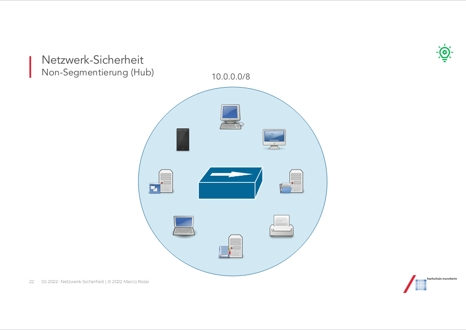
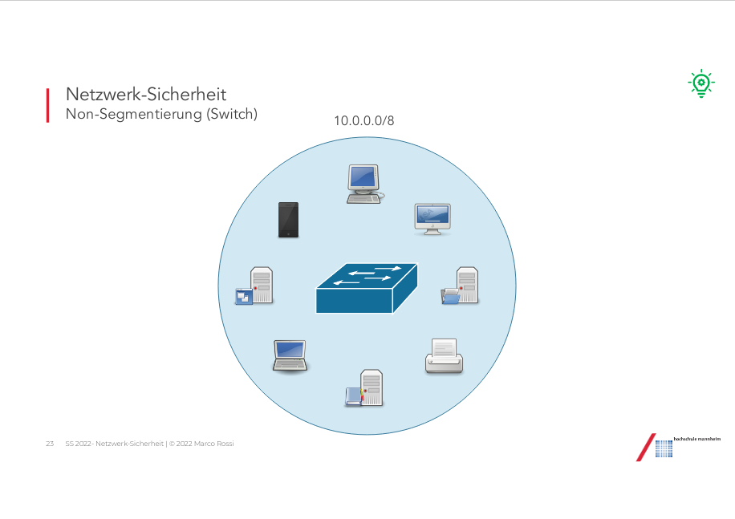

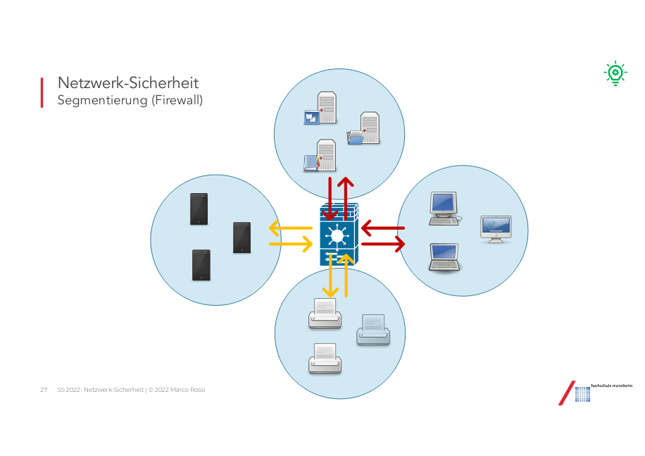

seite	lampen inhalt
66		cia - confidentiality, integrity, availability
68		Sicherheitsmechanismen 
		- authentisierung	Authentication
		- zugriffsschutz	Access protection/control 
		- Verschluesselung	Encryption
		- Protokollierung	Auditing
		Wichtige Abkuerzungen:
		ZTNA - Zero Trust Network Access
		PAM - Privileged Access Management

		interferenzkontrolle wird nicht abgefragt		

folgende Seiten auch lampe
		
82		CIA Baum

		RBAC - Roll Based Access Controll
84	 	Sicherheitsmassnahmen Matrix
		FireEye /Mandian Attack Livecycle

Massnahmen fuer sichere IT-Architektur
		Asset Datenbank (uebersicht ueber moeglichst alle IT-Systeme in Unternehmen)
		patchen (immer)
		pentesting
		
Lab umgebung Seite 12 in Virtualisierungsfoliensatz	

## Active Directory
17		Domain Controller sollte isoliert und kontrolliert laufen	

## 
4		RADIUS Port 1812
		Älteres Protokoll zum authentifizieren von Clients in Netzwerk (läuft über UDP)
		- zustandslos
		- unterstützt PAP(Password Authentication Protocol) und CHAP(Challenge Handshake ...)
		- auth über PPP(Point to Point)
		- NAS -> hier Network Access Server
9		Agent Pull und Push Sequenz (immernoch RADIUS)
10		Agent Push Sequenz
		- wird in der Regel nicht mehr benutzt
-->
