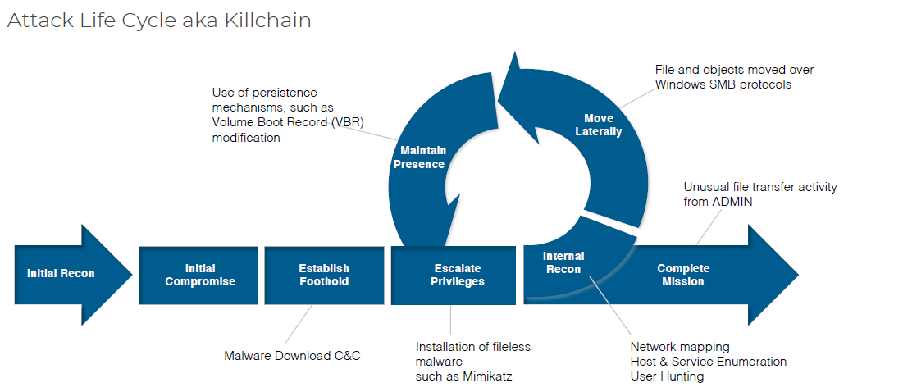

# NWS

## Grundlagen

### Attack Life Cycle

Ablauf eines Angriffs:
- Initial Recon - Daten und Informationen über das Ziel werden gesammelt
- Inital Compromise - Eine Schwachstelle wird genutzt um das System zu kompromittieren
- Establish Foothold - Schadsoftware wird heruntergeladen, Backdoors eingerichtet
- Loop:
    - Escalate Priviledges - Fileless Malware (z.B Mimikatz) wird installiert, Rechte missbraucht um an mehr Rechte zu gelangen
    - Internal Recon - Network mapping, Host & Server Informationen, User Hunting 
    - Move Laterally - Dateien und Objekte werden verschoben (z.B mit SMB Protokoll)
    - Maintain Persisitence - Volume Boot Record modifikationen u.Ä werden verwendet, um die Tür öffen zu halten
- Complete Mission - z.B Unusual file transfer activity von einem Admin Account



#### Bedrohungslage
Arten von Bedrohungen:
- Sicherheitslücken
- Schadprogramme
  - Trojaner
  - Viren, Würmer, Spyware, Keylogger
  - DoS
  - Spam, Phishing, Pharming
  - Bot-Netze
  - Dialer

#### Schutzziele
> Wichtig: C-I-A

|          |Begriff           |Bedeutung           |
|---       |---               |---                 |
| ```C```  |Confidentiality   |Vertraulichkeit     |
| ```I```  |Integrity         |Unversehrtheit      |
| ```A```  |Availability      |Verfügbarkeit       |
|          |Authenticity      |Authentizität       |
|          |Non-Repundiation  |Verbindlichkeit     |
|          |Legitimate Use    |Nutzungsbeschränkung|

- **Confidentiality**
  - Vertraulichkeit, Geheimhaltung
  - Verhindert werden soll das Anschauen, Ausspähen, Abfangen, Stöbern, Schnüffeln, Mitschneiden von Daten
- **Integrity**
  - Unversehrtheit
  - Verhindert werden soll die Nachichtenfälschung, Konfigurationsänderung, Änderung von Log-Dateien, Data-Diddling
- **Availability**
  - Verfügbarkeit
  - Verhindert werden sollen Schäden durch natürliche oder menschliche Störungen und DoS
- **Authenticity**
  - Authentizität
  - Verhindert werden soll eine Verfälschung des Absenders/Authors
- **Non-Repufiation**
  - Verbindlichkeit
  - Sicherstellen, dass Aktionen später vpn Beteiligten nicht abgestritten werden können
- **Legitimate Use**
  - Nutzungsbeschränkungen
  - Sicherstellen, das nut autorisierte Personen/Systeme Zugriff auf Ressourcen erlangen


#### Sicherheitsmechanismen
- Authentisierung (Authentication)
  - Identität von Akteuren wird sichergestellt
- Zugriffsschutz (Access protection/control)
  - Zugriffsversuche werden überwacht
- Verschlüsselung (Encryption)
  - Daten werden verschlüsselt
- Protokollierung (Auditing)
  - Sicherheitsrelevante Vorgänge im System werden protokolliert
- Einbruchsentdeckung (Intrusion detection)
  - Überwachung von Versuchen, Sicherheitsmaßnahmen zu umgehen
- Informationsflusskontrolle (Information flow control)
  - Überwachung des Informationsflusses zwischen Instanzen
- Verbergen (Steganography)
  - Daten werden durch das Einbetten in andere Daten unsichtbar
- Interferenzkontrolle (Interference control)
  - Schutz vor dem Ableiten von Daten von unberechtigten Parteien
- Sicherheitsanforderungen (Security Requirements)
  - Auftraggeber/Entwickler eines Systems legen fest, welche Schutzziele erreichbar sein sollen
  - Bei hohen Anforderungen kommen formale Sicherheitsmodelle zum Einsatz
- Sicherheitsrichtlinie (Security policy)
  - Sicherheitsrichtlinie-> Sicherheitsstrategie-> Umsetzungsvorgaben
  - Betreiber eines Systems legt im Detail fest, welche Schutzziele erreicht werden sollen

##### Schutzziele - Übersicht
|   |IT-Security|||
|---|---|---|---|
|Confidentiality</br>Vertraulichkeit |Integrity</br>Integrität |Availability</br>Verfügbarkeit |Liability</br>Verbindlichkeit |
|                                    | \>Übereinstimmung       |\>Fehlertoleranz               |\>Authentizität               |
|                                    | \>Genauigkeit           |\>Zuverlässigkeit              |\>Beherrschbarkeit            |
|                                    | \>Korrektheit           |\>Robustheit                   |\>Revisionsfähigkeit          |
|                                    | \>Vollständigkeit       |\>Wiederherstellbarkeit        |                              |

### Rahmenbedingungen und Standards

#### Stand der Technik
|Innovationsgrad   |Feld  |Bewährung in der Praxis   |
|---|---|---|
|hoch   |Stand von Wissenschaft und Forschung   |niedrig   |
|mittel   |**Stand der Technik**   |mittel   |
|niedrig   |Allgemein anerkannte Regeln der Technik   |hoch   |

> Der *Stand der Technik* bezeichnet die am Markt verfügbare Bestleistung eines Subjekts zur Erreichung eines Objekts.
> Subjekt ist die IT-Sicherheitsmaßnahme; Objekt das gesetzliche IT-Sicherheitsziel

#### Wichtige Standards
##### ISO/IEC 27000
- Anwendung der Grundprinzipien des Qualitätsmanagements auf das Management der Informationssicherheit
- ISO/IEC 27000 umfasst mehrere Dutzend Standards, mehr als die Hälfte noch in Arbeit und nicht veröffentlicht

##### ISO/IEC 27001
Legt Mindestanforderungen an sog. Information Security Management Systems (ISMS) fest
- Zertifizierung möglich für:
    - Organisationen
    - Personen
Inhalt:  
- Kontinuierliche Verbesserung durch Anwendung des Deming-Zyklus (PDCA, Plan, Do, Check, Act)
- Risikogetriebenes Vorgehen

##### BSI IT-Grundschutz
###### Vorgehensmodell:
- Definition des Informationsverbundes
- Durchführung einer IT-Strukturanalyse
- Durchführung einer Schutzbedarfsfeststellung
- Modellierung
- Durchführung eines Basis-Sicherheitschecks
- Durchführung einer ergänzenden Sicherheitsanalyse (evtl anschließende Risikoanalyse)
- Konsolidierung von Maßnahmen
- Umsetzung der IT-Grundschutzmaßnahmen

###### Basis-Sicherheitscheck
- Basis-Sicherheitscheck (Organisationsinstrument) bietet schnellen Überblick über vorgandenes IT Sicherheitsniveau
- Interviews zum ermitteln des Status Quo
- Betrachtet wird Informationsverbund im Bezug auf Umsetzungsgrad von Sicherheitsmaßnahmen der IT-Grundschutz-Kataloge
- **Ergebnis**: Ein Katalog, in dem für jede relevante Maßnahme der Umsetzungsstatus "*entbehrlich*", "*ja*", "*teilweise*", "*nein*" erfasst ist
- Durch Identifizierung von nicht/teilweise umgesetzten Maßnahmen werden Verbesserungsmöglichkeiten aufgezeigt
- Der Basis-Sicherheitscheck gibt Auskunft über fehlende Maßnahmen (Soll/Ist-Abgleich)
- Duch Basis-Sicherheitscheck werden nur Grundschutz-Maßnahmen geprüft - Niveau genügt nur bei niedrigen bis mittleren Schutzbedarf 
